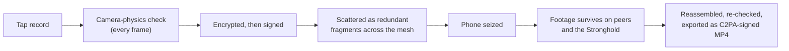

# Phalanx — the pitch

This is the plain-language case for Phalanx, written for a decision maker, a funder, or anyone deciding whether
the project deserves their attention. Every claim in it is meant to survive a hostile technical advisor: factual
statements carry a source — a file in this repository in `backticks`, or a public URL for claims about other
tools. The technical depth lives in [docs/architecture.md](docs/architecture.md),
[docs/network.md](docs/network.md), [docs/trust.md](docs/trust.md), and
[docs/threat-model.md](docs/threat-model.md); the unvarnished project status lives in
[docs/stewardship.md](docs/stewardship.md). Nothing here contradicts them.

---

## 1. The problem

Video used to be hard to fake and easy to keep. Both of those have flipped.

**It is now easy to fake.** Generative tools produce convincing video of events that never happened. The moment a
court, a newsroom, or the public knows this, every real video gets cheaper too — "that could be AI" becomes the
universal defense. The value of footage no longer rests on what it shows; it rests on whether anyone can prove
where it came from.

**It is still easy to destroy.** The most important recordings are made by people whose phones can be taken from
them — at a protest, at a checkpoint, at a border. A phone seized two minutes after recording usually means the
recording is gone, and with it the only copy of what happened. The people most likely to capture something that
matters are the people least likely to keep custody of their own device.

**And the usual fix creates a new single point of failure.** The standard answer is "upload it to a server."
But a server is a thing with an address and an owner. It can be subpoenaed, seized, pressured, defunded, or
simply switched off — and when it goes, every recording that depended on it goes with it. For witnesses whose
adversary may be a state, "trust our server" is not an answer; it is a relocation of the problem.

Phalanx is built on a different premise: the proof should be in the footage itself, and the custody should be in
the crowd. Each frame is checked against the physics of a real camera sensor at the moment of capture, then
encrypted, signed, and scattered in redundant fragments across nearby and remote devices *while recording is
still happening* — so by the time anyone reaches for the phone, the phone is no longer the only place the
evidence lives. No server is required for survival; an optional archival node (the
[Stronghold](docs/architecture.md#glossary)) adds durable custody and court-ready export when a friendly
organization runs one. The full design rationale is in [docs/architecture.md](docs/architecture.md).

## 2. Who it serves

**The witness with a phone.** A protest observer films an arrest. Within minutes, officers demand the phone.
With Phalanx, the recording begin leaving the device as fragments seconds after it started
(`crates/phalanx-node/src/actors/media_egress.rs`); the phone itself holds only an encrypted vault, and the
group rosters that could implicate others were never written to disk at all — they live in memory and die with
the process (`crates/phalanx-node/src/trust.rs:186`, `crates/phalanx-node/src/vitals/canary.rs:9-10`). Losing
the phone no longer means losing the footage, and surrendering the phone does not surrender the community.

**The community protecting each other's footage.** A legal-observer collective forms a
[trusted community](docs/trust.md#4-trusted-communities) — admission requires a quorum of existing members to
vouch cryptographically (`crates/phalanx-proto/src/identity/community.rs:73-286`). During an action, each
member's phone automatically carries fragments of the others' recordings. If a member goes silent
mid-recording — seized, broken, or jammed — a dead-man's-switch (the
[Silent Canary](docs/architecture.md#glossary)) alerts the rest of the group with which recordings are at risk
(`crates/phalanx-node/src/vitals/canary.rs:19`). Nobody's evidence depends on nobody's phone.

**The legal organization turning footage into court evidence.** An NGO or newsroom runs a Stronghold — an
ordinary wall-powered computer in an office expected to stay in friendly hands. It accepts archive pushes from
members' phones and returns signed custody receipts (`crates/phalanx-proto/src/evidence/archive.rs:129`); given
two recordings of the same event, it produces a statistical proof that they came from physically different
camera sensors (`crates/phalanx-forensics/src/trust/corroboration.rs:193-300`); and it exports a standard MP4
carrying a [C2PA](https://c2pa.org/) provenance manifest with the forensic measurements embedded
(`crates/phalanx-stronghold/src/ops/export.rs`) — a file any C2PA-aware tool can inspect.

## 3. A recording's journey

You tap record. Before each frame is even compressed, the raw sensor data is measured against the physics of a
real camera: genuine sensors carry an unavoidable noise fingerprint
([PRNU](docs/architecture.md#glossary)), and re-filming a screen leaves a tell-tale interference signature
([Moiré](docs/architecture.md#glossary)). Frames that fail — synthetic imagery, screen recaptures, frames with
no sensor fingerprint at all — are rejected at capture (`crates/phalanx-lens/src/lib.rs:30`,
`crates/phalanx-forensics/src/verification/gate.rs:303`).

Each surviving frame is encrypted, then signed — in that order, deliberately, so anyone can verify the signature
and the unbroken hash chain without being able to watch the video
(`crates/phalanx-node/src/actors/media_egress.rs:194-217`). The signed, encrypted evidence is fountain-coded
into redundant fragments — any sufficient subset reconstructs the original, in any order — and broadcast to
peers while recording continues (`crates/phalanx-forensics/src/pipeline/reassembler.rs:565`). Distribution is
probabilistic by design: more copies mean better survival odds, never a promise of delivery, and the
documentation says so plainly ([docs/network.md §7](docs/network.md#7-delivery-semantics)).

Then the phone is seized. What the seizing party holds: an encrypted vault sealed behind a passphrase-hardened
key (`crates/phalanx-node/src/identity.rs`), and no stored roster of who else was present
(`crates/phalanx-node/src/vitals/canary.rs:9-10`). What the witness holds: a 12-word recovery phrase that can
regenerate their identity and the keys to every recording they ever made
(`crates/phalanx-forensics/src/cryptography/dek.rs`).

At the Stronghold, fragments reassemble into the recording — and the one property this whole scatter-gather
design depends on, that the result is identical no matter what order fragments arrive in, is proven in a
machine-checked Lean 4 theorem (`proofs/Phalanx/MoldCommutativity.lean:263`). At export, the camera-physics
checks run a second time on the actual decrypted pixels — spoofed capture-time measurements are caught here —
and the result is an MP4 with an embedded C2PA manifest carrying the sensor metrics and, where available, the
multi-device corroboration proof (`crates/phalanx-forensics/src/pipeline/export.rs:79`,
`crates/phalanx-forensics/src/pipeline/c2pa_ext.rs`). The frame-by-frame technical version of this story, with
its own diagrams, is [docs/architecture.md § Life of a frame](docs/architecture.md#life-of-a-frame-outbound).

## 4. Where it stands among existing tools

Phalanx is not the first tool for witnesses. It enters a field with serious, admirable incumbents, and an honest
pitch places it among them. The comparison below is drawn from each tool's published materials (URLs in the
prose that follows); where we state that a capability is absent, we mean it does not appear in the materials we
reviewed — not that the tool could never add it.

| | eyeWitness | ProofMode | Tella | C2PA ecosystem | Phalanx |
|---|---|---|---|---|---|
| **Who holds the evidence** | One institutional server (LexisNexis-managed) | The user; optional decentralized storage | Your organization's server | N/A — a label standard, not storage | The witness's community mesh, plus optional Strongholds |
| **If the phone is seized mid-event** | Uploaded footage is safe; un-uploaded footage exists only on the device | Proof bundles live with the media, wherever the user keeps them | Encrypted and hidden on-device until uploaded | Out of scope | Fragments already left the device during recording |
| **Provenance mechanism** | Hash + metadata at capture | PGP signatures, Google attestation, timestamping, C2PA | Metadata sidecar for human analysts | Certificate-authority-issued signing credentials | Per-frame sensor physics + signatures + hash chain, exported *as* C2PA |
| **Deepfake stance** | Not addressed in reviewed materials | Metadata-level detection; pixel-level is future work | Not addressed in reviewed materials | Proves who signed, not what the sensor saw | Physics checks at capture, re-checked at export, plus multi-sensor corroboration |
| **Court track record** | 104 dossiers; convictions in the DRC | None found in reviewed sources | None found in reviewed sources | Broad industry adoption | **None — not field-deployed** |

**[eyeWitness to Atrocities](https://www.eyewitness.global/services)** (International Bar Association, since
2015) is the court-outcomes gold standard: over a decade it has captured 85,000+ items and submitted 104 legal
dossiers to accountability mechanisms
([IBA](https://www.ibanet.org/IBA-founded-eyeWitness-to-Atrocities-marks-ten-years-of-capturing-evidence-of-human-rights-crimes)),
and in 2018 a DRC military tribunal convicted two militia commanders of crimes against humanity with 92
eyeWitness images in evidence
([TRIAL International](https://trialinternational.org/latest-post/drc-two-militiamen-found-guilty-of-crimes-against-humanity/)).
Its chain of custody is anchored in a single secure server
([justiceinfo.net](https://www.justiceinfo.net/en/40176-mass-atrocities-there-s-an-app-for-that.html)) — which
is exactly the institutional model Phalanx's mesh custody is designed to complement, not replace: an
organization like eyeWitness is the natural operator of a Stronghold.

**[ProofMode](https://proofmode.org)** (Guardian Project, with WITNESS) does serverless capture-time signing
with notarization via Google's attestation servers and OpenTimestamps
([Guardian Project](https://guardianproject.info/2017/03/30/proofmode-critiques-and-progress/)), and has adopted
C2PA. Its generative-AI detection inspects metadata and manifests; pixel-level analysis is listed as future work
([ProofCheck announcement](https://guardianproject.info/2025/03/18/generative-ai-detection-in-proofcheck/)). Its
developers are commendably candid that the approach "is not bulletproof." Custody is left to the user.

**[Tella](https://tella-app.org/security-and-privacy/)** (Horizontal) is the strongest device-protection story:
automatic encryption at capture, hidden galleries, app camouflage, quick-delete — feeding collected material to
an organization's server. Its verification mode is a metadata sidecar for human analysts to cross-check
([Tella features](https://tella-app.org/features/)); the materials we reviewed describe no per-capture
cryptographic provenance.

**The [C2PA](https://c2pa.org/faqs/) ecosystem** has the distribution muscle — Adobe, Google, Microsoft, Sony,
OpenAI on the steering committee, and capture support moving into phone silicon
([Truepic/Qualcomm](https://www.truepic.com/blog/qualcomm-embeds-truepics-secure-media-library-as-feature-in-snapdragon-8-elite-gen-5)).
But C2PA's own FAQ scopes what it proves: provenance of the signing, not factual truth, and no automatic
deepfake detection. The World Privacy Forum's review documents the consequence — misleadingly edited videos have
received valid C2PA credentials, because the system "does not measure trustworthiness of its data, but
rather... of the Signer" ([WPF](https://worldprivacyforum.org/posts/privacy-identity-and-trust-in-c2pa/)).
Phalanx's posture is to *export into* this ecosystem, not compete with it: its C2PA manifests embed what the
standard itself does not check — sensor-noise measurements and corroboration proofs
(`crates/phalanx-forensics/src/pipeline/c2pa_ext.rs`).

**Phalanx's ground, and the honest concession.** None of the tools we reviewed documents multi-device
corroboration of the same scene as a verification primitive, and none of them combines on-device sensor
forensics with custody that survives device seizure without depending on a central server. That combination is
Phalanx's uncontested ground. The concession is just as plain: every tool above has shipped to real users;
eyeWitness has real convictions; Phalanx has been deployed in zero field operations. It is, today, an engine
with strong evidence behind its claims (§9) and no operational track record. Section 6 says exactly what exists.

## 5. The deepfake claim, stated with its conditions

Precision matters most here, because this is where over claiming would be easiest.

**What a single device proves.** Every frame is measured at capture for the noise fingerprint a physical sensor
cannot help producing and the interference signature screen re-filming cannot help producing; frames that fail
are rejected before they ever enter the pipeline (`crates/phalanx-forensics/src/verification/gate.rs:303-391`).
The same checks run a second time from the decrypted pixels at export, by whoever produces the court artifact
(`crates/phalanx-forensics/src/pipeline/export.rs:108`) — so a forger cannot simply attach plausible-looking
measurements to synthetic pixels. Combined with the signature and hash chain, a single device supports the
claim: *these frames passed real-sensor physics checks on this identity's device at this time, and have not
been altered since.*

**What requires two or more devices.** A Stronghold can prove more: that two overlapping recordings of an event
came from *physically distinct camera sensors*. It requires distinct signing identities, a minimum temporal
overlap (default five seconds, `crates/phalanx-stronghold/src/config.rs:132`), at least 10 frames per device in
the overlap, intact hash chains, and a statistical test showing the two sensors' noise profiles are
distinguishable (`crates/phalanx-forensics/src/trust/corroboration.rs:193-300`). To be exact about what this is:
**physically distinct sensors, not distinct humans.** One person holding two phones passes. What it defeats is
the cheaper and more dangerous forgery — one sensor, or one synthetic source, masquerading as independent
witnesses.

**What Phalanx cannot prove.** It cannot prove that what happened in front of the lens is what it appears to
be — a staged scene filmed with a real camera passes every physics check. It cannot prove who was holding the
phone. It does not determine truth; it raises the cost of fabrication from "generate a video" to "defeat sensor
physics on a real device, live, at capture time." One documented limitation: in near-total darkness (mean
luminance below 1.0), the threshold scaling that the synthetic-frame check depends on degenerates, so very dark
frames are accepted with a logged warning rather than tested — the outright bypass check still applies, but the
synthetic-image floor does not (`crates/phalanx-forensics/src/verification/gate.rs:337-350`). A hostile expert
will find that in the code; better that you hear it here first.

## 6. What exists today, and what is being pitched

Candidly, from the maturity table in [docs/stewardship.md §2](docs/stewardship.md#2-maturity-table): the Rust
engine — capture pipeline, sensor forensics, encryption, signing, fountain-coding, mesh transport, vault,
communities, recovery — is real, runs in the default build, and is exercised by the workspace test suite. A
functional Android app exists and is built from source, but it is a development build: fixed dev passphrase,
debug signing, no background-recording service (`flutter_app/lib/main.dart:58-62`). The Stronghold CLI works,
including C2PA export. There is no iOS app (the core library cross-compiles; no app project exists), no app
store presence, and mobile C2PA export currently returns a documented `NoEncoder` error because the software
encoder is excluded from mobile builds by patent policy (`crates/phalanx-ffi/src/export.rs:232-237`). The
mesh runs over IP; off-grid operation means the same mesh over a local WiFi/hotspot link (a BLE seam was
built, then deliberately excised in July 2026 — BLE could not carry video and its proximity witnesses were
never load-bearing). Known rough edges are documented rather
than hidden: the phone and Stronghold gossipsub topic defaults were misaligned until June 2026 — they now share
canonical defaults pinned by a cross-crate regression test
([docs/network.md §3](docs/network.md#3-topics-who-publishes-who-listens)). And it has not been field-deployed. What is being pitched is not a finished product; it is a tested engine plus
a fully-costed, honestly-documented path to one ([docs/stewardship.md §7](docs/stewardship.md#7-the-productization-gap-list)).

## 7. Background

This started as a way to use AI tools to learn Rust and it rapidly got out of hand. This is also my first mobile
application. I cut my teeth learning QBASIC and writing C++ in notepad — not because I'm especially hardcore,
but because it was what was available to me at the time. I've spent the past few years writing Python code
professionally. I wouldn't describe myself as a 10x engineer. Truth be told, I am jealous of those that can whip
through code at lightning speed with VIM keybindings. I wish I could but I've broken, dislocated, or sprained
every single one of my fingers — it's the price you pay to be a middle blocker in volleyball. I call my right
index finger my "weather finger." My bottleneck has never been ideas. It's always been syntax and keystrokes.
Phalanx is 100% my ideas and roughly 10% of my keystrokes.

I'm not an expert in any of the fields you see in this repo (well, I do have a PhD in numerical analysis so
there's that) but I don't have to be because I can RTFM. The nerds of yore knew that there would come a time
when someone else would need to invoke the deep magic. That's why they wrote it down. There are some genuinely
novel ideas in this code base, but for the most part it is an act of synthesis that is heavily influenced by
Grace Hopper and Margaret Hamilton.

Grace Hopper believed that the language should be the logic. She dared to believe that the machines should meet
the humans where they are — that's why we have compilers. Margaret Hamilton, the woman who coined the phrase
"software engineering", believed that software deserved the same level of rigor as the hardware that it ran on.
Both were dismissed and they built the thing anyway — and they were right to do it. I'm not Grace Hopper. I'm
not Margaret Hamilton. I'm just someone that had an idea that they wanted to try out — and now the world has
Phalanx. Use it or don't. Hopefully, at least one person will find it useful.

## 8. The ask

Four things, in order of importance:

1. **Stewards.** Phalanx is a solo build, and a system whose purpose is eliminating single points of failure
   cannot have one as its maintainer. The complete handoff package — invariants, claims registry, sharp edges,
   reading order — is [docs/stewardship.md](docs/stewardship.md); a competent Rust team can be safe in this
   codebase in the time it takes to do the reading and the four builds listed there (§8).
2. **An external security audit.** The cryptography and protocol have been through internal audit rounds (the
   C2, R3-1, and M7 markers in the code); they have never had independent review. This is the single largest
   credibility step available for the money.
3. **Pilot partners.** An organization already doing witness work — a legal-observer network, an NGO, a
   newsroom — willing to run Strongholds and phones in a real deployment and feed reality back into the defaults.

## 9. Credibility appendix

So that no claim in this document outruns its evidence, here is the project's own classification of its headline
claims, from strongest artifact to weakest ([docs/stewardship.md §3](docs/stewardship.md#3-claims-to-evidence-registry)).

**Machine-checked**: exactly one development qualifies — the Lean 4 theorem
`recording_order_independent`, that reassembling fragments in any order yields the identical recording
(`proofs/Phalanx/MoldCommutativity.lean:263-270`), with its scope limits documented (the assembly function is
axiomatized, the Rust correspondence is by-hand mirroring, and CI does not yet build the proofs).

**Numerically certified**: the stability of the adaptive control system — an SDP-derived Lyapunov matrix checked by compile-time
Cholesky at all 15,552 grid vertices (`crates/phalanx-node/src/stability/contractivity.rs:328-407`), behind a
non-default build feature.

**Simulation-tested**: Sybil resistance, eclipse resistance, replay defense, recovery
from overload, and evidence survival against silent, corrupting, forging, and colluding peers — asserted by
adversarial simulation suites running real actor constellations over a virtual transport
(`crates/phalanx-sim/tests/`).

**Code-anchored**: the signing, encryption, gating, and revocation mechanisms —
implemented and unit/integration tested, including five compile-failure tests proving verified evidence cannot
be forged from outside the crate (`crates/phalanx-forensics/src/unit.rs:14-61`) — without a separate certificate
for each headline property.

**Asserted**: the emergent-behavior narratives (natural load-shedding order, load
balancing without a balancer), which are design consequences with partial, indirect simulation coverage and no
dedicated artifact.
