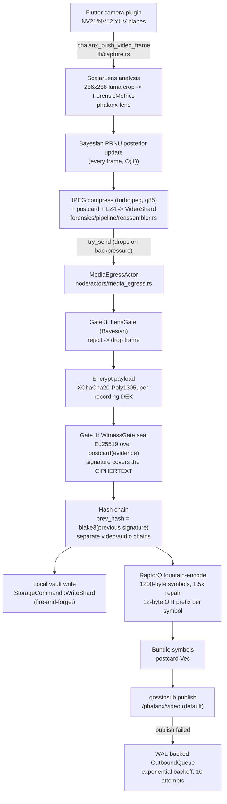
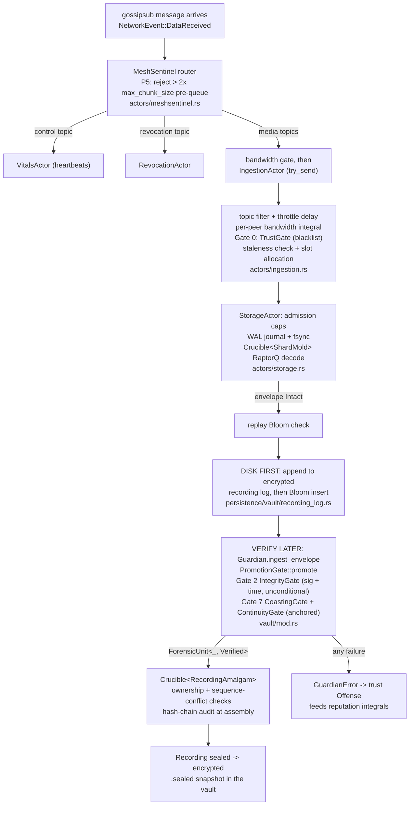

# Phalanx Architecture — system overview, glossary, and the life of a frame

This document is the entry point for understanding Phalanx as a system: what it is, what runs where, what the internal codenames mean, and what happens to a single video frame from the camera sensor to encrypted custody on another machine. For attack-by-attack analysis read [threat-model.md](threat-model.md); for mesh topology read [network.md](network.md); for identity and communities read [trust.md](trust.md).

Conventions: every factual claim here is anchored to a source path in backticks, with a line number where the specific value matters (e.g. a default). Constructor names in this codebase carry semantic suffixes — `new_ephemeral()`, `new_verified_unchecked()`, `new_uninformed()`, `TrustRegistry::build()` — because the suffix documents the construction invariant; do not assume a bare `new()` exists ([../linguistic-code-model.md](../linguistic-code-model.md) §V).

---

## What Phalanx is

Phalanx is a distributed forensic evidence provenance system. It exists to answer one question in a way that survives hostile scrutiny: *did this video come from a real camera, operated at a real time and place, and has it been altered since?* It is built for people who record events under threat — protest observers, journalists, human-rights documenters — whose devices may be seized minutes after recording.

The system has three parts:

**A mobile recording app** (Flutter UI over a Rust core, bound through a C ABI — `crates/phalanx-ffi`). It solves the *capture provenance* problem: every video frame is fingerprinted at the sensor (PRNU noise and Moiré energy analysis, `crates/phalanx-lens`), compressed, encrypted, Ed25519-signed, and hash-chained before it leaves the process. Synthetic frames, AI-generated imagery, and screen recaptures are rejected at capture time by physics-based checks; every receiver then cryptographically re-verifies what it gets (signature, hash, chain continuity — receivers see only ciphertext and cannot analyze pixels), and the physics checks run a second time from the actual decrypted pixels at export, by whoever produces the court artifact.

**A peer-to-peer mesh** (libp2p gossipsub + Kademlia, `crates/phalanx-transport`). It solves the *seizure window* problem: evidence is fountain-coded into redundant symbols and broadcast to nearby and remote peers while recording is still in progress, so destroying the recording device does not destroy the recording. Distribution is redundancy-probabilistic — more replicas means higher survival odds — not a delivery guarantee, and the design is honest about that.

**An optional custody server, the Stronghold** (`crates/phalanx-stronghold`). A wall-powered node in a location expected to stay in friendly hands — a legal office, a newsroom, an NGO. It solves the *custody and presentation* problem: it accepts directed archive pushes and returns signed custody receipts, aggregates evidence from community members, produces statistical proofs that two recordings of the same event came from physically different camera sensors, and exports court-presentable C2PA-signed MP4 files.

A deployment can be phones only (mesh redundancy between participants), or phones plus one or more Strongholds (durable custody and export). All parts speak the same wire protocol and are one flat swarm — there are no protocol-level node classes.

One framing point before anything else: **Phalanx is pseudonymous, not anonymity software.** Every envelope carries a stable witness identity (`WitnessId`, `crates/phalanx-proto/src/identity/did.rs:268`), every gossipsub publish is signed by the node's transport key (`crates/phalanx-transport/src/builder.rs:155`), and mesh presence is linkable to authorship by design — accountable witnesses are part of the evidentiary model, since evidence from an unattributable source has little forensic value. What the system protects is *content* (encryption before broadcast), *group membership* (RAM-only rosters, generic topics), and *access* (per-recipient grants) — not the fact that a given identity participates in the mesh.

The codebase itself is governed by an explicit architectural document, [../linguistic-code-model.md](../linguistic-code-model.md), which partitions the workspace into: **phalanx-proto** (the "Dictionary" — inert data types and capability traits, no IO), **phalanx-forensics** (the "Laboratory" — pure verification and pipeline logic, no filesystem or network), **phalanx-transport** (the "Post Office" — libp2p delivery, mapped to domain types at the boundary), and **phalanx-node** (the "Sentence" — running, environment-dependent composition). This partition is enforced by the crate dependency graph, not just convention.

---

## Node taxonomy and the seizure asymmetry

Every Phalanx process joins **one flat libp2p swarm**. Roles are behavioral, not structural: there is no role field in the protocol, and the well-known gossipsub topics are a fixed global set (`crates/phalanx-proto/src/network/topic.rs`). What differs between roles is which binary runs, what hardware it touches, and — critically — what it writes to disk.

The deliverables, at a glance:

| Artifact | Kind | Role | Source |
|---|---|---|---|
| Flutter app + `phalanx-ffi` | C-ABI library (`cdylib`/`staticlib`) | the production phone node | `crates/phalanx-ffi/Cargo.toml:15`, `flutter_app/` |
| `sentinel` | binary | headless desktop node; capture hardware is stubbed | `crates/phalanx-node/Cargo.toml:11-12` |
| `stronghold` | binary | custody daemon (CLI) | `crates/phalanx-stronghold/Cargo.toml:11-12` |
| `stronghold-gui` | binary, behind the `gui` feature | custody desktop app (egui) | `crates/phalanx-stronghold/Cargo.toml:15-16` |

No other crate declares a binary target. In more detail:

- **The phone node** — not a binary but a C-ABI library: `crates/phalanx-ffi` builds `["cdylib", "staticlib", "rlib"]` (`crates/phalanx-ffi/Cargo.toml:15`) for Android/iOS, bound by the Flutter app in `flutter_app/`. Real production capture enters here: Flutter's camera plugin pushes raw NV21/NV12 YUV planes into `phalanx_push_video_frame` (`crates/phalanx-ffi/src/capture.rs:293`). A Bluetooth/WiFi-Direct local-mesh **integration seam exists** at `crates/phalanx-ffi/src/local_mesh.rs` — C-ABI functions that would let Flutter-owned radios feed peer-discovery and data events into the node — but **the radio transports themselves are not implemented**. Today the mesh runs over IP (QUIC and TCP, `crates/phalanx-node/src/config.rs:226-231`).
- **The headless `sentinel` binary** (`crates/phalanx-node/Cargo.toml:11-12`) — the same node logic on desktop. Its camera and microphone drivers are explicit stubs (the camera generates noise frames and is marked "[STUB] Real implementation would use nokhwa here", `crates/phalanx-node/src/hardware/camera.rs:130`; the audio driver is a sine-wave generator, `crates/phalanx-node/src/hardware/audio.rs`). It is a mesh participant and test/robustness vehicle, not a production capture device.
- **The Stronghold** — two binaries from `crates/phalanx-stronghold`: a CLI daemon (`stronghold`) and an egui GUI (`stronghold-gui`, behind the `gui` feature) (`crates/phalanx-stronghold/Cargo.toml:11-16`). Its event router is `StrongholdSentinel` (`crates/phalanx-stronghold/src/sentinel.rs:44`).

### The seizure asymmetry

The two device classes have opposite physical threat profiles, and persistence is routed accordingly. This is the single most important design decision to understand before auditing the system, and it is documented as such in [threat-model.md §17](threat-model.md), which treats mobile as **seizable** and the Stronghold as **operator-safe**.

State that could implicate collaborators — community rosters, who-was-present monitoring, what evidence was recently processed — lives only in RAM on the phone and dies with the process. **Mobile ephemerality is not a durability gap; it is the defense.** Conversely, the Stronghold *must* persist community rosters, because dropping them on restart would orphan every shard filed under a community directory (threat-model.md §17, "persistence there is required, not optional").

| State | Phone / sentinel (`phalanx-node`) | Stronghold |
|---|---|---|
| Device identity | `identity.bin`, Argon2id-passphrase-sealed; regenerable from the BIP-39 phrase (`crates/phalanx-node/src/identity.rs`) | `stronghold_identity.bin`, same sealed format (`crates/phalanx-stronghold/src/bin/stronghold.rs`) |
| Evidence vault | Encrypted per-recording append-only logs + keyring under the vault path (`crates/phalanx-node/src/persistence/vault/`) | `{vault}/evidence/{hex(community_id)}/{blake3(recording_id)}/shards/` (`crates/phalanx-stronghold/src/persistence/evidence_store.rs`) |
| Community membership | **RAM-only** — `TrustRegistry.communities` is `#[serde(skip)]`; `save()` writes only the peer map (`crates/phalanx-node/src/trust.rs:186`) | **Persisted** under `{vault}/communities/`, auto-hydrated on boot (`crates/phalanx-stronghold/src/gui/bridge.rs`) |
| Peer reputation | Persisted in `trust_registry.bin` (plaintext postcard); seizure-tolerable because a blacklisted DID reveals no event or group context (threat-model.md §17) | n/a (no equivalent registry) |
| Replay Bloom filter | **RAM-only**, two rotating generations; reseeded on boot from already-persisted envelopes (`crates/phalanx-node/src/actors/storage.rs:287`) | RAM-only equivalent in the aggregation path |
| Silent Canary watch set | **RAM-only** — "If the phone is seized, disk must not contain a MeshAddress -> Did roster" (`crates/phalanx-node/src/vitals/canary.rs:9-10`) | n/a |
| Custody deadlines / fairness ledger | n/a | Persisted sidecars `{vault}/custody/{blake3(rid)}.bin` + `revoked.bin`, reconciled on boot (`crates/phalanx-stronghold/src/actors/aggregation.rs`) |
| Export artifacts | n/a (mobile self-export writes to a caller-supplied path) | `{vault}/exports/` — deliberately a sibling of `evidence/`, so custody reclaim can never delete a delivered artifact (`crates/phalanx-stronghold/src/persistence/evidence_store.rs:45-51`) |

One operational note: until June 2026 the default gossipsub topic sets of the node and the Stronghold were misaligned — mismatched media-topic strings, a `serde(skip)` config-file footgun on the Stronghold, and a revocation topic that nobody subscribed to. They are now unified on the canonical `MeshTopic` constructors in `crates/phalanx-proto/src/network/topic.rs`, the revocation topic is in both default subscribe lists, and a cross-crate regression test pins the alignment (`crates/phalanx-stronghold/tests/topic_alignment.rs`); [network.md §3](network.md#3-topics-who-publishes-who-listens) has the full topic matrix. One deliberate gap remains: [Silent Canary](#glossary) alerts on `/phalanx/mesh/1.0.0` are publish-only until an inbound alert handler exists (`crates/phalanx-node/src/actors/canary_supervisor.rs:308-314`; see Design Law 3 and network.md §3) — local canary detection works regardless.

---

## Glossary

The canonical mapping from prose codename to code. Other documents link here rather than re-defining terms. Some prose names below differ from the code type that implements them (Guardian Vault → `Guardian`, custody receipt → `ArchiveReceipt`), and two (Silent Canary, Shield Wall) name concepts spread across several types rather than a single domain type — each row says which.

| Term | Meaning | Where it lives |
|---|---|---|
| **WitnessEnvelope** | The primary signed evidence record: a piece of `Evidence` plus its BLAKE3 hash, the witness's Ed25519 signature, the recorder's DID, an optional link to the previous envelope's signature hash (forming a chain), and an embedded revocation public key. This is what crosses the network and gets stored. | `crates/phalanx-proto/src/evidence/envelope.rs:53` |
| **Evidence (enum)** | The closed set of forensic payload kinds: exactly six variants — `Video(VideoShard)`, `Audio(AudioShard)`, `Gap(ForensicGap)`, `Handover(HandoverProof)`, `Proximity(ProximityWitness)`, `ManifestEntry(ManifestEntry)`. | `crates/phalanx-proto/src/evidence/envelope.rs:79` |
| **ForensicUnit (Unverified / Verified / Sealed)** | A compile-time wrapper tagging a payload with its verification state. `Unverified` = raw off the wire; `Verified` = Ed25519 witness signature checked; `Sealed` = authorized for egress with encryption applied. Sealed trait set, `pub(crate)` privileged constructors, no Serialize/Deserialize — a `Verified` unit cannot be forged outside `phalanx-forensics`, and CI compile-fail doctests prove it. | `crates/phalanx-forensics/src/unit.rs:100` |
| **Crucible** | A generic stateful aggregation engine: holds keyed work-in-progress buffers, asks a `Mold` strategy when each is complete, then assembles and emits the finished output. Used twice in series — symbols into envelopes, then envelopes into recordings. | `crates/phalanx-forensics/src/pipeline/crucible.rs:117` |
| **Mold** | The strategy trait a Crucible runs: defines the key, the accumulator, how to ingest each item (rejecting adversarial data), when the buffer is ready, and how to assemble the output. | `crates/phalanx-forensics/src/pipeline/crucible.rs:85` |
| **ShardMold** | The Mold that turns network `ShardChunk`s (RaptorQ fountain symbols) back into a complete `WitnessEnvelope`, with per-shard byte budgets (64 MiB) and a hard cap of 2,000 symbols per context. | `crates/phalanx-forensics/src/pipeline/reassembler.rs:351` |
| **RecordingAmalgam** | The Mold that assembles signature-verified envelopes into a complete `Recording`, tracking ownership (Tentative vs Authoritative) and rejecting sequence collisions and unauthorized handovers. Its input type is `ForensicUnit<WitnessEnvelope, Verified>` — unverified data cannot even be offered to it. | `crates/phalanx-forensics/src/pipeline/crucible.rs:343` |
| **Guardian** ("the Guardian Vault") | The node's encrypted on-disk evidence vault: owns the in-memory Crucible, per-recording encryption keys, recording logs, WAL, and storage accounting. The code type is `Guardian`; "Guardian Vault" is the documentation name. | `crates/phalanx-node/src/persistence/vault/mod.rs:127` |
| **MeshSentinel** | The phone/desktop node's top-level orchestrator actor: spawns every other actor, then runs a `select!` loop routing network events, FFI commands, and timers to dedicated actors. Deliberately holds no business logic or business state. | `crates/phalanx-node/src/actors/meshsentinel.rs:144` |
| **Stronghold** | The desktop/server role: a wall-powered node that aggregates community evidence, produces corroboration proofs, and does C2PA export. Crate `phalanx-stronghold`, router `StrongholdSentinel`, binaries `stronghold` (CLI) and `stronghold-gui` (feature-gated egui). | `crates/phalanx-stronghold/src/sentinel.rs:44` |
| **Shield Wall** | A prose umbrella used for three related things: Trusted Communities (`community.rs` header), spectral Byzantine-peer detection (`spectral.rs` header), and the group of defensive actors spawned together by `actors::fleet` ([actors.md](actors.md)). No public domain type implements the concept; the only code artifact bearing the name is the `pub(crate)` channel-and-handle bundle `fleet::ShieldWall`, which groups the defensive actors spawned by `spawn_shield_wall`. | `crates/phalanx-node/src/actors/fleet.rs:50`, `crates/phalanx-proto/src/identity/community.rs:3` |
| **Silent Canary** | A community-scoped dead man's switch: during an active recording it watches community peers' mesh presence; if a peer goes dark (disconnect plus confirmed heartbeat staleness) it broadcasts an encrypted alert naming the silent peers and at-risk recordings. All state is memory-only. Code types: `CanaryMonitor`, `CanarySupervisor`, `CanaryAlert` — `SilentCanary` is not a type name. | `crates/phalanx-node/src/vitals/canary.rs:19` |
| **ForensicLens** | The sensor-fingerprinting trait: implementations analyze the luma (Y) plane of a frame inside a 256×256 L1-cache-sized crop and produce `ForensicMetrics` (Moiré energies, PRNU variance, mean luminance). The scalar implementation is `ScalarLens`. | `crates/phalanx-lens/src/lib.rs:30` |
| **LensGate** | Gate 3 of the verification pipeline: all-zero metrics = bypass attempt; PRNU variance below a luminance-scaled floor = possible synthetic/AI image; Moiré energy above a luminance-scaled ceiling = possible screen recapture. A Bayesian variant (`check_provenance_bayesian`) uses the online `PrnuPosterior` instead of fixed thresholds. | `crates/phalanx-forensics/src/verification/gate.rs:314` |
| **PRNU** | Photo Response Non-Uniformity — the per-sensor noise fingerprint every real camera exhibits. Phalanx records its variance per frame (`ForensicMetrics.prnu_var`), calibrates a per-device Bayesian posterior online, and uses pairwise Kolmogorov–Smirnov divergence of PRNU profiles to prove two recordings came from physically different sensors. | `crates/phalanx-proto/src/evidence/envelope.rs:124` |
| **Moiré energy** | Horizontal and vertical Laplacian energy of the analyzed crop (`h_energy` / `v_energy`). High Moiré energy is the signature of re-filming a screen, so the LensGate rejects frames whose energy exceeds a luminance-scaled ceiling. | `crates/phalanx-proto/src/evidence/envelope.rs:120` |
| **grant / SealedLocator** | Per-recipient access delegation. A `SealedLocator` points at a `RecordingId` and carries the recording key encrypted via X25519 ECDH so only the named recipient DID can open it, plus `GrantPermissions` (playback, export) authenticated as AAD so a man-in-the-middle cannot flip them. Displays as a `phx-grant://` URI. | `crates/phalanx-proto/src/identity/crypto.rs:98` |
| **DID / WitnessId** | Two renderings of the same Ed25519 identity: `Did` is the `did:key` URI string (forensic identity); `WitnessId` is the bs58 multibase form (`z6Mk...`) on every signed envelope, deliberately stable even if the libp2p transport is ever replaced. `MeshAddress` (libp2p PeerId base58) is a third, routing-only rendering. | `crates/phalanx-proto/src/identity/did.rs:109` |
| **MeshTopic** | Type-safe gossipsub topic name, normalized to `/phalanx/<name>`. Five well-known topics exist — `video/1.0.0`, `audio/1.0.0`, `control/1.0.0`, `revocation/1.0.0`, and `mesh/1.0.0` (the generic encrypted topic, used so canary alerts are indistinguishable from normal traffic). Routing privacy comes from encryption, not per-community topics. | `crates/phalanx-proto/src/network/topic.rs:7` |
| **Community / CommunityId** | A trusted community is a web of trust with no central keypair: members are admitted when a quorum *k* of existing members sign Ed25519 vouches. `CommunityId` is a deterministic, domain-separated BLAKE3 hash of the founding name, quorum, and sorted member DIDs. Communities carry a baseline `TrustLevel`, grants, and an expiry after which they dissolve via `Zeroize` — the absence of the object is the dissolved state. | `crates/phalanx-proto/src/identity/community.rs:240` |
| **TrustRegistry** | The node's local social graph: a `Did -> PeerRecord` map (pet name, trust level, reputation) persisted to `trust_registry.bin`, plus the RAM-only communities map and a live `ReputationProjection` that transport code reads lock-free. Built with `TrustRegistry::build(&config)` (async) — there is no `new()`. | `crates/phalanx-node/src/trust.rs:175` |
| **TrustLevel** | The four-rung peer trust ladder, exactly: `Blocked`, `Ignored` (default), `Verified`, `Ally` — in ascending `Ord` order. Community membership can raise a peer's effective floor, but levels are assigned locally. | `crates/phalanx-proto/src/identity/trust.rs:26` |
| **RevocationToken** | A signed, self-verifiable intent to destroy all evidence for a recording, signed by a revocation keypair derived from the BIP-39 mnemonic (seed bytes 32..64) that is never stored on the device. Revocation is permanent and irreversible by design — even the mnemonic holder cannot un-revoke. | `crates/phalanx-proto/src/evidence/revocation.rs:49` |
| **fountain code / RaptorQ symbol** | Envelopes are fountain-encoded with RaptorQ: each `ShardChunk` carries one encoding symbol addressed by an `EncodingSymbolId` (a symbol address, not an array index) with a 12-byte OTI prefix making every symbol self-describing. Any sufficient subset reconstructs the envelope; completeness is decided by the decoder, never by sender-declared counts. | `crates/phalanx-proto/src/evidence/envelope.rs:34` |
| **custody receipt (ArchiveReceipt)** | The signed attestation a Stronghold returns on accepting an archive push: the `Stored` variant commits the replica to holding the shards until a stated time, self-verifiably signed. The code type is `ArchiveReceipt`; "custody receipt" is the prose name. The related `CustodyLedger` enforces per-owner storage fairness. | `crates/phalanx-proto/src/evidence/archive.rs:129` |
| **CorroborationProof** | The Stronghold-produced proof of independent multi-device capture: an event overlap window, per-device attestations (frame counts, PRNU profiles, chain head/tail hashes), pairwise sensor-divergence KS results, optional proximity witnesses — all signed by the producing Stronghold. | `crates/phalanx-proto/src/evidence/corroboration.rs:118` |
| **Volterra integrals / homeostasis** | The node's adaptive control system (`SystemGovernor`): resource pressures feed exponentially decaying accumulators `I(t+dt) = impulse + I(t)·exp(−λ·dt)` — Volterra second-kind integrals computed exactly, with no Euler step-size error. The integral bank drives power states, ingestion throttling, and Byzantine decoupling. See [homeostasis.md](homeostasis.md). | `crates/phalanx-forensics/src/policy.rs:384` |
| **SpectralObserver** | Per-peer behavioral consistency checker (part of the Shield Wall): compares each peer's claimed load/leaf-state/integral summary from heartbeats against its observed heartbeat timing and data volume. The residual feeds the peer's reputation integral toward decoupling. See [spectral-observer.md](spectral-observer.md). | `crates/phalanx-node/src/vitals/spectral.rs:47` |
| **PendingEgress** | A queued outbound response awaiting retry (channel id, response, attempt count, next-attempt time). It crosses the `TransientJournal` salvage boundary so it lives in `phalanx-proto`, but it is deliberately excluded from the prelude — import it directly from `phalanx_proto::storage`. | `crates/phalanx-proto/src/storage.rs:68` |
| **TransientJournal** | The persistence capability contract (a Noun, defined in the Dictionary, not where it is implemented): write-ahead-log chunk recording, egress salvage, Crucible workbench recovery, and revocation persistence. `phalanx-node`'s `FileJournal` implements it. | `crates/phalanx-proto/src/storage.rs:134` |
| **TrustedClock** | Two things share this name: the trait in `phalanx-proto` (`fn now() -> PhalanxTimestamp`, the only sanctioned time source for security-critical paths — `PhalanxTimestamp::now()` is `pub(crate)` to force this) and the NTP-synchronized struct in `phalanx-node/src/clock.rs:71` that implements it, whose own `now()` returns `Result<PhalanxTimestamp, TimeError>` with a last-known-good fallback. | `crates/phalanx-proto/src/time.rs:49` |
| **Linguistic Code Model roles** | The architectural partition: phalanx-proto = Dictionary (Nouns, no IO), phalanx-forensics = Laboratory (Verbs and gate Conjunctions, no fs/network), phalanx-transport = Post Office (delivery without comprehension), phalanx-node = Sentence (running composition). phalanx-test-fixtures is the dev-only Phrasebook; phalanx-ffi is the "Larynx"; the environment-touching layer is informally "the Hands". | [../linguistic-code-model.md](../linguistic-code-model.md) |

### Known naming drift

Stale comments a new maintainer will trip over — the *code* is correct in each case, the prose around it lags:

- `verification/gate.rs:1` — the header comment still says `src/gate.rs`; the file moved to `src/verification/gate.rs` and is consumed as the flattened re-export `phalanx_forensics::gate`.
- `verification/bloom.rs:8,27` — comments say hashes are "SHA-256"; the keys actually fed to the filter are BLAKE3 `evidence_hash` values. The bit-position math is hash-algorithm-agnostic.
- `crates/phalanx-proto/src/evidence/corroboration.rs:132` — the `proof_hash` field comment says "SHA-256 hash of the proof body"; the implementation computes BLAKE3 (`crates/phalanx-stronghold/src/ops/corroborate.rs:165`).
- `threat-model.md:39` calls the Continuity Gate "Gate 8", which collides with the Corroboration Gate's "Gate 8" label in code (`crates/phalanx-forensics/src/trust/corroboration.rs:3`). The gate table in this document follows the code.

---

## Life of a frame (outbound)

What happens between a photon hitting the phone's sensor and an encrypted, signed, fountain-coded copy of the frame leaving over the mesh.



Step by step, with the crate and file at each hop:

1. **Capture.** Flutter's camera plugin hands raw YUV planes to `phalanx_push_video_frame(handle, y_plane, …, pixel_format, recording_id, …)` (`crates/phalanx-ffi/src/capture.rs:293`). All heavy work runs inside `tokio::task::spawn_blocking` so the camera callback returns immediately. Capture FPS is power-state-driven: `target_fps` halves the rate when conserving and divides by five in leaf state (`crates/phalanx-node/src/hardware/camera.rs:40`).

2. **ForensicLens.** Before any compression — compression destroys the raw sensor signal — `ScalarLens.analyze()` runs on the Y plane: a 256×256 center crop (sized so the whole 64 KB buffer fits in L1 cache, `crates/phalanx-lens/src/lib.rs:18`), two passes computing PRNU variance, mean luminance, and horizontal/vertical Laplacian (Moiré) energy (`crates/phalanx-lens/src/scalar.rs`). Frames smaller than the crop return all-zero metrics — which is deliberately kept as a forensic signal, because the LensGate treats all-zero metrics as a bypass attempt.

3. **LensGate calibration.** Every frame updates a per-device Bayesian posterior for the linear model `prnu_var = α·luminance + β` — six floating-point sufficient statistics, O(1) per frame, no explicit calibration step (`crates/phalanx-proto/src/evidence/envelope.rs:160`, update in `crates/phalanx-forensics/src/pipeline/calibrate.rs`). The posterior is shared between the capture path and the egress actor, and a snapshot is persisted every 100 frames.

4. **Compress and shard.** The frame is JPEG-compressed (turbojpeg, quality 85, 4:2:0) and wrapped by `create_video_shard` into a `VideoShard` — postcard-serialized frames, LZ4-compressed, carrying the lens metrics, sequence id, fps, and recording id (`crates/phalanx-forensics/src/pipeline/reassembler.rs:107`). The mobile path wraps each pushed frame as its own shard (`vec![compressed]`, `crates/phalanx-ffi/src/capture.rs:456`); the desktop stub drivers instead batch roughly one second of frames or PCM per shard (`crates/phalanx-node/src/hardware/camera.rs:369`). The shard is `try_send`-ed to `MediaEgressActor`; on backpressure the frame is dropped rather than stalling the camera.

5. **Outbound gate.** `MediaEgressActor` re-checks provenance with `check_provenance_bayesian` against the posterior — video only; audio has no lens metrics (`crates/phalanx-node/src/actors/media_egress.rs:268`). A rejected frame is dropped *before* encryption.

6. **Encrypt.** The payload becomes `DataPayload::Encrypted` under XChaCha20-Poly1305 with a 24-byte random nonce (`crates/phalanx-forensics/src/verification/judge.rs`). The actor prefers the per-recording content key (a DEK derived from the identity's `dek_master`) and falls back to the vault key (`media_egress.rs:288-296`). Encryption deliberately happens on this async worker, not the FFI capture thread — on low-end devices, blocking the camera HAL return path on AEAD plus entropy drops frames (`media_egress.rs:42-47`). Encryption failure is fatal for the shard: it is dropped "to prevent plaintext broadcast" (`media_egress.rs:300`).

7. **Sign — and the signature covers the ciphertext.** `evidence.seal(...)` (Gate 1, the WitnessGate) calls `WitnessEnvelope::sign_envelope`, which postcard-serializes the evidence *as it now is* — encrypted — hashes those bytes with BLAKE3 into `evidence_hash`, and Ed25519-signs the same bytes (`crates/phalanx-forensics/src/pipeline/witness.rs:27-46`; ordering at `media_egress.rs:194-204`). Because the payload was mutated to ciphertext *before* sealing, the witness signature is computed over nonce + ciphertext, never plaintext. The consequence is load-bearing: **any node can verify a signature without being able to decrypt the evidence** — storage relays and Strongholds verify custody-grade integrity with zero read access — and any re-encryption necessarily breaks the signature, so the ciphertext itself is the immutable artifact.

8. **Hash chain.** Each envelope's `prev_hash` is BLAKE3 of the *previous* envelope's witness signature; the actor keeps two independent chains, one per media stream (`media_egress.rs:198-217`, anchor computation in `witness.rs:90-92`). The first envelope of each stream has `prev_hash = None`. Dropped, reordered, or injected envelopes break the chain at reassembly.

9. **Local persist first.** The sealed envelope is cloned to the storage actor (`StorageCommand::WriteShard`) fire-and-forget *before* wire serialization — local storage failure does not block mesh distribution, but without this write a locally-recorded frame would exist only in transit (`media_egress.rs:219-229`).

10. **Fountain-shard.** The postcard-serialized envelope is RaptorQ-encoded: one whole envelope is one fountain source object, and each emitted `ShardChunk` carries one encoding symbol prefixed with a 12-byte Object Transmission Information header, so the receiver can initialize its decoder from *any* symbol — about 1% framing overhead at the default symbol size (`crates/phalanx-forensics/src/pipeline/reassembler.rs:565,612`). Each envelope gets a monotonic `ShardId` so receivers track reassembly contexts independently.

    ```text
    ShardChunk.data — one fountain symbol on the wire:

    +-----------------------------+--------------------------------+
    | OTI prefix (12 bytes)       | RaptorQ encoding symbol        |
    | ObjectTransmissionInfo —    | (symbol_size bytes,            |
    | makes the symbol            |  default 1,200)                |
    | self-describing             |                                |
    +-----------------------------+--------------------------------+
    ```

    The encoding knobs and their defaults (all in `phalanx-proto`, overridable per node):

    | Knob | Default | Why | Source |
    |---|---|---|---|
    | Symbol size | 1,200 bytes | fits a single UDP datagram under typical MTU | `crates/phalanx-proto/src/types.rs:360` |
    | Repair ratio | 1.5 | 50% extra repair symbols; decode survives ~30% symbol loss (regression-tested at `reassembler.rs:899`) | `crates/phalanx-proto/src/types.rs:344` |
    | Symbol bundle size | 1 (max 100) | preserves pre-bundling behavior; raise to amortize per-publish signing | `crates/phalanx-proto/src/types.rs:382-403` |
    | `max_chunk_size_bytes` | 8,192 | gossipsub `max_transmit_size` is set to 2× this, i.e. 16 KiB by default | `crates/phalanx-node/src/config.rs:240`, `crates/phalanx-transport/src/builder.rs:152` |

    A tuning coupling for maintainers: the bundle-size maximum's doc comment assumes ~120 KB bundles stay "safely under typical gossipsub max_transmit_size" (`types.rs:380`) — that holds only if `max_chunk_size_bytes` is raised above its 8,192 default. At defaults (bundle = 1, symbol = 1,200) every publish is well under the 16 KiB ceiling; oversized publishes surface as `MessageTooLarge` counted in the libp2p adapter.

11. **Bundle and publish.** Symbols are batched into bundles of `symbol_bundle_size` (default 1; max 100) and published as one postcard `Vec<ShardChunk>` per `egress.publish()` call (`media_egress.rs:315-334`) through the `EgressPort` trait — the Dictionary-level contract whose production implementation is the libp2p adapter. Every gossipsub publish is individually signed by the node's libp2p key (`MessageAuthenticity::Signed`, `ValidationMode::Strict`, `crates/phalanx-transport/src/builder.rs:155-161`); bundling exists to amortize exactly that per-message signing cost. Failed publishes go to a WAL-backed on-disk queue: 5 s retry tick, exponential backoff capped at 5 minutes, abandonment after 10 attempts with a forensic log event, 16 MiB queue cap (`crates/phalanx-node/src/persistence/outbound.rs`). Queue pressure feeds back into the control system, which lowers capture FPS — the queue regulates its own growth (`media_egress.rs:468`).

The default publish topics are the canonical `/phalanx/video/1.0.0` / `/phalanx/audio/1.0.0` pair shared by node and Stronghold since the June 2026 alignment fix — see the topic note in the taxonomy section and [network.md §3](network.md#3-topics-who-publishes-who-listens).

---

## The inbound gauntlet

Receiving is where Phalanx assumes everyone is lying. A chunk arriving off the wire passes through routing, admission, reassembly, cryptographic promotion, and aggregation — in that order, with the cheap checks first.



**Routing.** `MeshSentinel` is a pure event router — its own doc comment warns that adding stateful handlers "is a regression toward the God Object shape this actor was split out of" (`crates/phalanx-node/src/actors/meshsentinel.rs:567-571`). Inbound data larger than 2× `max_chunk_size_bytes` is rejected before anything else (P5, `meshsentinel.rs:869-879`). Control-topic traffic goes to the vitals actor (drop-tolerant `try_send`), revocation traffic to the revocation actor (no-drop `send().await`), everything else toward ingestion — behind a bandwidth gate that drops chunks outright when the bandwidth integral is saturated (`meshsentinel.rs:881-922`).

**Size limits form a layered funnel.** Each stage's ceiling is enforced independently, so no single check is load-bearing:

| Stage | Limit | Anchor |
|---|---|---|
| Pre-queue (MeshSentinel) | 2 × `max_chunk_size_bytes` (16 KiB at defaults) | `meshsentinel.rs:871` |
| Deserialization (Gate 0a) | 64 MiB unmarshal input cap | `gate.rs:23` |
| Fountain accumulation (per shard context) | 64 MiB and 2,000 symbols | `reassembler.rs:306-310` |
| Decoded assembly | 64 MiB decoded-size bound | `reassembler.rs:467` (S3, in `ShardMold::assemble`) |
| Payload decompression | 128 MiB LZ4 decompression-bomb ceiling | `reassembler.rs:153` |

**One deliberate bypass.** Shards arriving as *directed* DHT responses (retrieval and recovery traffic, not gossip) skip `IngestionActor` entirely: `MeshSentinel` forwards each envelope straight to the storage actor as a `WriteShard`, fire-and-forget, and notifies the canary supervisor of the contribution (`meshsentinel.rs:1016-1059`). The doc comment explains the shape: awaiting per-envelope disk replies would stall the router's select loop on disk latency, while the bounded channel still provides backpressure on queue depth. These envelopes face the same disk-first-verify-later vault path as everything else.

**Admission.** `IngestionActor` drops chunks whose topic is neither the configured video nor audio topic, applies the governor's throttle delay, then per chunk: a per-peer bandwidth integral, **Gate 0** (TrustGate — the sender DID's standing against the local reputation oracle; blacklisted DIDs are dropped), a staleness check against a dynamic temporal tolerance, and slot allocation whose capacity is scaled by the Sybil-resistance endowment (`crates/phalanx-node/src/actors/ingestion.rs:108-238`). Accepted chunks are forwarded to the storage actor, and the vault's per-chunk verdict closes the loop: success records positive peer evidence, a `GuardianError` maps to a typed offense (`ReplayDetected → ReplayAttack`, `VerificationFailed → InvalidSignature`, …) against the sender's reputation (`ingestion.rs:259-300`).

**The gates, in their real code order and numbering.** The gate module is `crates/phalanx-forensics/src/verification/gate.rs` (consumed as `phalanx_forensics::gate`; the file's header still says `src/gate.rs` — a stale path comment). The numbers are stable labels, not an index, and two of them intentionally do not exist:

| Gate | Name | Side | What it checks |
|---|---|---|---|
| 0 | TrustGate | receive | sender DID not blacklisted (`gate.rs:75`) |
| 0a | unmarshal size cap | receive | input ≤ 64 MiB before postcard decode (`gate.rs:20-44`) |
| 0b | `unmarshal_checked` | receive | structural `WireBound` invariants on decoded values (`gate.rs:52-64`) |
| 1 | WitnessGate | egress | Ed25519 sealing at capture (`gate.rs:92`) |
| 2 | IntegrityGate | receive | signature + temporal freshness, both **unconditional** (`gate.rs:116`) |
| 3 | LensGate | egress + export | sensor provenance — PRNU floor, Moiré ceiling, all-zero bypass (`gate.rs:303`); runs at capture egress (`crates/phalanx-node/src/actors/media_egress.rs:277`) and again from decrypted pixels at export (`crates/phalanx-forensics/src/pipeline/export.rs:108`), never on mesh receive — receivers hold only ciphertext |
| 4 | PrivacyGate | egress | payload encryption before broadcast (`gate.rs:178`) |
| 7 | CoastingGate | receive | BLAKE3 fast-hash binding of `evidence_hash` to content (`gate.rs:487`) |
| 8 | Corroboration Gate | Stronghold | multi-device independence (`crates/phalanx-forensics/src/trust/corroboration.rs:3`) |
| — | ContinuityGate | receive | `prev_hash` chain link; carries no number in code (`gate.rs:516`) |

Gates 5 and 6 do not exist anywhere in `crates/` — numbers were assigned to concepts as they were designed, and retiring a concept retires its number. That is fine: the numbers are names. One genuine inconsistency to flag: `docs/threat-model.md:39` calls the Continuity Gate "Gate 8", which collides with the Corroboration Gate's claim to 8 in code. Trust the code labels above.

**Gate 2 has no fast path.** `check_integrity` always runs full Ed25519 verification — there is no trusted-peer shortcut — and always runs temporal validation, even for hash-chain-anchored envelopes, so an attacker who knows a valid `prev_hash` cannot inject future-dated evidence (`gate.rs:129-175`). Only after both does the anchored path skip secondary checks. `verify_envelope` itself also re-checks that `evidence_hash` matches the actual content before checking the signature, closing a Bloom-filter dedup bypass (`witness.rs:60-88`).

**Typestate promotion: Unverified → Verified.** `PromotionGate::promote` orchestrates the gauntlet — integrity, then fast-hash when anchored, then chain continuity — and only then mints `ForensicUnit<WitnessEnvelope, Verified>` via the `pub(crate)` constructor (`gate.rs:557-585`). This wrapper is one of the system's strongest claims, and it is worth understanding why:

- `ForensicUnit` **has no wire form**. Evidence crosses the network as a bare `WitnessEnvelope`; a receiver must re-wrap it `Unverified` and run a gate (`crates/phalanx-forensics/src/unit.rs:95-98`). Verification status is therefore *non-transferable* — no peer can assert "already verified" at another peer.
- The states (`Unverified`, `Verified`, `Sealed`) form a **sealed trait set** — a private supertrait means no outside crate can add a privileged fourth state (`unit.rs:65-73`).
- The privileged constructors `new_verified_unchecked` and `seal_unchecked` are **`pub(crate)`** — only the gates inside `phalanx-forensics` can mint them (`unit.rs:123,134`). The only public constructor is `ForensicUnit::new` on the `Unverified` state (`unit.rs:107`).
- Five **`compile_fail` doctests** are compiled by CI as separate external crates and must fail to compile: naming either unchecked constructor externally, constructing by struct literal, implementing `ValidationState` on an outside type, and deserializing a unit from bytes (`unit.rs:14-61`). If any one starts compiling, "an evidence-forgery path has reopened and this test turns red."

Downstream code then encodes its requirements in types: `RecordingAmalgam`'s input is `ForensicUnit<WitnessEnvelope, Verified>` (`crucible.rs:359`), so unverified data cannot even be *offered* to the permanent archive. There is also `promote_signed` — a signature-only promotion without temporal/continuity checks — for consumers like the Stronghold archive whose evidence may legitimately be old and whose replay protection is structural (sequence-collision dedup), not wall-clock freshness (`gate.rs:548-597`).

**Replay filtering, and a documented tradeoff.** `StorageActor` keeps a two-generation rotating Bloom filter keyed on `evidence_hash` (1M bits per generation, rotated on a 1-second tick, never persisted — reseeded on boot from up to 50 recently persisted hashes per recording; `crates/phalanx-node/src/actors/storage.rs:47,157,287`, `crates/phalanx-forensics/src/verification/bloom.rs`). The processing order is **filter-check → disk append → filter-insert → verify**. That order is a deliberate, documented performance tradeoff: an attacker who scrapes an honest envelope can mangle its signature (same `evidence_hash`) and poison the local filter so the honest copy is briefly rejected as a replay — but the blast radius is local-node only and bounded to one rotation cycle, because every other peer re-verifies independently. Flipping to verify-before-filter would cost a full Ed25519 verification per duplicate-hash arrival on the hot path — the *common case* for legitimate gossip. The code says "Do NOT reorder … without updating threat-model.md" (`storage.rs:621-649`), and [threat-model.md §3](threat-model.md) carries the matching analysis.

**Disk-first, verify-later.** An intact envelope is appended to the encrypted per-recording log *before* in-memory verification — "1. Disk first … 2. Verify in memory (data is already safely on disk)" (`storage.rs:621,674`). Each frame is individually encrypted with the recording's resolved key and fsynced on append (`crates/phalanx-node/src/persistence/vault/recording_log.rs:42,111`); the log keeps an in-memory sequence-to-offset index for O(1) random access. The rationale: verification can always be repeated; bytes lost in a crash mid-verification cannot. Revoked recordings are rejected at both the append and the ingest layer, so disk-first cannot resurrect destroyed evidence.

```text
.recording log — one append-only frame per shard (recording_log.rs:111-112):

+----------------+--------------------+-----------------------------------------+
| seq_id         | payload_len        | payload — payload_len bytes total:      |
| 4 bytes, LE    | 4 bytes, LE        | 24-byte XChaCha20 nonce, then           |
|                |                    | ciphertext + AEAD tag (one shard)       |
+----------------+--------------------+-----------------------------------------+
```

`payload_len` counts the nonce *plus* the ciphertext (`payload_len = nonce.len() + ciphertext.len()`, `recording_log.rs:112`) — a parser must take the ciphertext length as `payload_len − 24`.

**The Crucible, twice.** Reassembly is two Mold strategies run in series. First `Crucible<ShardMold>` (keyed by `ShardId`) accumulates fountain symbols until the RaptorQ decoder — not any sender-declared count — reports successful decode, under hard resource bounds: 64 MiB per context, 2,000 symbols per context, 50 concurrent contexts per peer DID, 30-second inactivity eviction (`crates/phalanx-forensics/src/pipeline/reassembler.rs:180-310`). Every accepted chunk is journaled and fsynced to the `TransientJournal` WAL before Crucible processing, and the whole reassembler state is recoverable from the WAL after a crash. Then, after promotion, `Guardian::ingest_envelope` — "the sole entry point for data promotion into the permanent archive" — computes the chain anchor from the previous sequence's envelope, clamps temporal tolerance to an absolute 30-second maximum, runs `PromotionGate::promote`, and feeds the `Verified` unit into `Crucible<RecordingAmalgam>` (`crates/phalanx-node/src/persistence/vault/mod.rs:439`). The Amalgam enforces an ownership state machine (Tentative until a genesis shard — video sequence 0 — or a dual-signed handover makes it Authoritative; non-matching DIDs against an authoritative owner are rejected as identity theft) and sequence-collision rules (identical duplicates dedup silently; divergent content at the same sequence is a hard conflict) (`crucible.rs:373-466`). At assembly it walks envelopes in sequence order, emits `ForensicGap` records for holes, and audits the full hash chain — a mismatch logs "CAUSALITY BREACH" and aborts the assembly.

One result here is machine-checked: the headline theorem of the repository's single Lean 4 development, `recording_order_independent` (`proofs/Phalanx/MoldCommutativity.lean:263`, supported by four commutativity lemmas in the same file), proves that for any set of non-conflicting shards, `RecordingAmalgam` ingestion followed by assembly yields the identical `Recording` under *any* arrival permutation — exactly the property fountain-coded, out-of-order delivery needs. It is the only machine-checked proof in the project; the control-system stability result is a numerical certificate ([contractivity-proof.md](contractivity-proof.md)), not a machine-checked proof.

**Shutdown semantics.** The ingestion and storage actors run biased `select!` loops where the shutdown arm wins deterministically, followed by a post-loop drain so already-queued chunks still reach the vault (`ingestion.rs:77`, `storage.rs:153`). The media egress actor, by contrast, exits *without* flushing its retry queue — an accepted loss, documented in code: "if the network is broken enough that the retry queue isn't draining, nothing at shutdown time can flush it either" (`media_egress.rs:96-101`). The WAL preserves those entries for the next boot.

**Vault encryption.** Completed recordings are committed as encrypted `.sealed` snapshots under the vault key; per-recording DEKs for the node's *own* recordings are derived deterministically from `dek_master` + recording id (a pure function — this is what makes recordings recoverable from the BIP-39 phrase alone), while foreign recordings get random keys stored in the keyring, itself encrypted at rest (`vault/mod.rs:249-311`). The vault key is derived from the identity key material plus a random salt, so identity-key compromise alone does not unlock the vault (`crates/phalanx-node/src/persistence/vault/crypto.rs:16-36`).

---

## After ingestion: custody, corroboration, export, recovery

### Archive push and custody receipts

When a recording commits, the node's `ArchiveCoordinator` pushes its envelopes to each configured archival peer as a signed `ArchiveRequest` (`crates/phalanx-node/src/actors/archive_coordinator.rs`). If the peer is configured with a Stronghold DID, the request carries an *export grant*: the recording's DEK re-derived from `dek_master` and sealed to that DID with `GrantPermissions { playback: false, export: true }` — and the request signature covers the grant, so it cannot be stripped or substituted in transit (`crates/phalanx-node/src/actors/archive_grant.rs`, tamper tests in `crates/phalanx-forensics/src/archive.rs`). The Stronghold verifies the request signature, re-verifies every envelope's Ed25519 signature (`promote_signed`), enforces fail-closed fairness quotas (per-owner, per-community, global — defaults 2 GB / 20 GB / 100 GB with a 0.25 per-owner fair-share ratio, `crates/phalanx-stronghold/src/custody.rs`, `config.rs`), and replies with a signed `ArchiveReceipt::Stored` committing to hold the shards until a stated deadline (default TTL 7 days). The node verifies the receipt's self-signature before recording it. The Stronghold never decrypts custody content during aggregation — decryption authority arrives only as sealed grants.

### Custody handover

Transferring ownership of a recording is dual-signed: `HandoverProof` carries a deterministic transfer manifest (recording, sequence, old DID, new DID, chain anchor) BLAKE3-hashed and Ed25519-signed by *both* the old and new identities; verification requires both signatures (`crates/phalanx-forensics/src/storage/handover.rs`). A handover is also an ownership authority signal inside the `RecordingAmalgam`.

### Corroboration

The Stronghold's Corroboration Gate (Gate 8) takes two or more recordings of the same event and produces a signed `CorroborationProof` if and only if: the owners' DIDs are distinct, the recordings overlap temporally by a configured minimum (default 5 s), each device contributes at least 10 video frames inside the overlap, each chain has intact head/tail hashes, and **every pairwise two-sample Kolmogorov–Smirnov test over per-frame PRNU variance shows the sensors are statistically distinguishable** (p-value strictly below α, default 0.05 — the test is used inverted: indistinguishable sensors *reject* corroboration) (`crates/phalanx-forensics/src/trust/corroboration.rs:192-304`). Be precise about what this proves: **physically distinct camera sensors, not distinct humans.** One person holding two phones passes the sensor-divergence test; what it defeats is one sensor (or one synthetic source) masquerading as independent witnesses. Proximity witnesses strengthen a proof but are never required. The proof body is BLAKE3-hashed and Ed25519-signed by the producing Stronghold (`crates/phalanx-stronghold/src/ops/corroborate.rs:149-185`; note the proto field comment saying "SHA-256" is stale — the implementation is BLAKE3).

### C2PA export

One shared Laboratory verb, `export_recording_to_signed_mp4` (`crates/phalanx-forensics/src/pipeline/export.rs:79`), serves both mobile self-export and Stronghold escrow export, so both produce identical artifacts from a single code path: decrypt + decompress, **re-verify provenance from the actual decrypted pixels** (`verify_provenance_from_jpeg` per frame — spoofed capture-time metrics are caught here), transcode to H.264/AAC MP4, embed a C2PA manifest carrying aggregate forensic metrics, and Ed25519-sign with the exporter's real identity key wrapped in a self-signed certificate. C2PA validators will report the signing credential as untrusted — the code treats that as honest: the forensic data, not a certificate authority, is the trust anchor (a CA-issued cert path exists for Strongholds that configure one, `crates/phalanx-stronghold/src/signing.rs`). The software encoder (`SoftwareTranscoder`: openh264 + fdk-aac + mp4 mux) sits behind the `software-transcode` Cargo feature, **default-off** in `phalanx-forensics` because fdk-aac is non-free and self-built openh264 is patent-exposed (`crates/phalanx-forensics/Cargo.toml:51-64`); the Stronghold enables it unconditionally. **On a mobile/FOSS build without the feature, `phalanx_export_c2pa` returns `NoEncoder`** — the native MediaCodec/VideoToolbox backend is a documented follow-up, not present today (`crates/phalanx-ffi/src/export.rs:202-238`). Stronghold escrow export runs autonomously once a granted recording has been quiescent (default 120 s), writes artifact and signed `ExportReceipt` atomically to `{vault}/exports/`, and survives restarts without re-exporting.

### BIP-39 recovery

Identity generation draws 16 bytes of OS entropy into a BIP-39 mnemonic; the 64-byte seed yields the Ed25519 signing key (bytes 0..32), the revocation public key (bytes 32..64), and — via HKDF over the whole seed — `dek_master` (`crates/phalanx-node/src/identity.rs:53-102`). `restore(phrase)` re-derives the identical identity, and because per-recording DEKs are deterministic HKDF expansions of `dek_master`, **the phrase alone restores the ability to decrypt every recording captured under that identity** (`crates/phalanx-forensics/src/cryptography/dek.rs`). A deterministic per-identity *manifest recording* catalogs every publishable recording at start; a fresh device re-derives the manifest's id from the phrase, fetches it from the mesh, and walks it to recover each child recording through the ordinary shard pipeline — recovery reuses the existing machinery, no new protocol (`crates/phalanx-node/src/actors/recovery.rs`). The revocation *signing* key is derivable only from the phrase and is never written to disk (`identity.rs:47-49`).

Depth on each of these: mesh mechanics in [network.md](network.md), identity/community/grant model in [trust.md](trust.md), adversarial analysis in [threat-model.md](threat-model.md).

---

## Design laws

The recurring decisions, stated as decisions. Each entry: the law, why, and where it is enforced.

1. **The signature covers the ciphertext.** Payloads are encrypted *before* sealing, so the Ed25519 witness signature is computed over nonce + ciphertext (`crates/phalanx-node/src/actors/media_egress.rs:194-204`, `crates/phalanx-forensics/src/pipeline/witness.rs:33-46`). *Rationale:* any relay or custodian can verify integrity and provenance without read access, and re-encryption breaks the signature — the ciphertext is the immutable forensic artifact.

2. **Verification is non-transferable.** `Verified` exists only as an in-process typestate with no wire representation; every node re-runs the gates on everything it receives, and there is no trusted-peer path that skips signature verification (`crates/phalanx-forensics/src/unit.rs:95-98`, `crates/phalanx-forensics/src/verification/gate.rs:137-149`). *Rationale:* a "verified" bit on the wire is an assertion by the sender; Phalanx does not accept assertions where it can recompute proofs.

3. **Few static generic topics; route by encryption.** Five well-known topics exist, and community traffic (including canary alerts) flows over the generic `mesh/1.0.0` topic encrypted with keys derived from the `CommunityId` (`crates/phalanx-proto/src/network/topic.rs`, `crates/phalanx-node/src/actors/canary_supervisor.rs`). One operational gap remains: `mesh/1.0.0` is deliberately publish-only — no inbound alert handler exists yet, so the topic is in no default subscribe list (subscribing without the handler would misroute alerts into evidence ingestion; see § Node taxonomy and the doc comment on `orchestrator::subscribe_topics`). *Rationale:* per-community or dynamic topics turn gossipsub subscription patterns into a membership oracle — an anonymity-set leak. Who can *read* a message is decided by keys, never by topology.

4. **Reputation never crosses the wire.** Trust levels, offenses, and blacklists live in the local `TrustRegistry` and its in-process projection; community membership is explicitly "NOT gossiped — membership is private" (`crates/phalanx-node/src/trust.rs:184-185`), and no code path publishes reputation to the mesh. *Rationale:* gossiped blacklists are a slander primitive — an attacker who can influence shared reputation can excommunicate honest witnesses. Every node forms its own opinion from its own observations.

5. **Privacy by encryption and grants, never by suppressing reachability.** Access control is per-recipient `SealedLocator` grants with permissions authenticated as AAD inside the ECDH seal (`crates/phalanx-proto/src/identity/crypto.rs:72-113`). The only suppression lever is the local-only per-recording `publishable` flag — operator policy metadata that "must never leak into signed evidence" (`crates/phalanx-proto/src/evidence/envelope.rs`). *Rationale:* hiding nodes from the mesh trades a cryptographic guarantee for an obscurity heuristic and breaks the redundancy that keeps evidence alive.

6. **Disk first, verify later.** Reassembled envelopes hit the fsynced, encrypted recording log before in-memory verification (`crates/phalanx-node/src/actors/storage.rs:621-674`, `crates/phalanx-node/src/persistence/vault/recording_log.rs:111`). *Rationale:* verification is repeatable; bytes lost in a crash are not. Revocation checks at both layers ensure persistence-first cannot resurrect destroyed evidence.

7. **Failure is asymmetric — reject-legitimate is recoverable, accept-fake is not.** Stated verbatim at the Moiré threshold: "accepting a deepfake is unrecoverable; rejecting a legitimate frame just means the next frame passes" (`crates/phalanx-forensics/src/verification/gate.rs:208-210`), and again as "easy to be honest, expensive to be dishonest" (`gate.rs:264`). *Rationale:* at 30 fps, a false rejection costs 33 ms of footage; a false acceptance poisons the evidentiary value of everything around it. Thresholds are tuned tight accordingly.

8. **Mobile is ephemeral; the Stronghold persists.** Rosters, watch sets, replay filters, and proximity logs are RAM-only on the seizable device class and durable on the operator-safe one ([threat-model.md §17](threat-model.md), `crates/phalanx-node/src/trust.rs:186`, `crates/phalanx-node/src/vitals/canary.rs:9`). *Rationale:* persistence is routed by physical threat profile. Do not "fix" mobile ephemerality — it is the defense, not a gap.

9. **Completeness is derived from data, never from sender-declared fields.** The RaptorQ decoder — not a count in the message — decides when an envelope is recovered; `EnvelopeState` has a single `Intact` variant (`crates/phalanx-proto/src/evidence/envelope.rs:32,244-251`). *Rationale:* any sender-declared total is an attacker-controlled input to the receiver's resource accounting.

10. **Revocation is permanent and irreversible.** A valid `RevocationToken` cannot be cancelled — even by the mnemonic holder — and triggers crypto-shredding in crash-safe order: destroy keys first, then data, then mark revoked (`crates/phalanx-proto/src/evidence/revocation.rs:43-47`, `crates/phalanx-node/src/persistence/vault/mod.rs:530`). *Rationale:* the threat model prioritizes a witness's right to destroy their own evidence over recoverability from accidental revocation.

---

## Reading map

Where to go next, by question:

| Question | Document |
|---|---|
| How does the mesh actually move bytes — topics, DHT, QUIC, bundling, retry? | [network.md](network.md) |
| How do identity, trust levels, communities, vouching, and grants work? | [trust.md](trust.md) |
| What attacks were considered, and what stops each one? | [threat-model.md](threat-model.md) |
| What actors run inside a node process, and who owns what state? | [actors.md](actors.md) |
| Where is X implemented? (code index by subsystem) | [subsystems.md](subsystems.md) |
| How does the adaptive control system (power states, throttling) work? | [homeostasis.md](homeostasis.md), with the Lyapunov certificate in [contractivity-proof.md](contractivity-proof.md) and Byzantine detection in [spectral-observer.md](spectral-observer.md) |
| What are the rules for writing code in this repo? | [../linguistic-code-model.md](../linguistic-code-model.md), plus [../CONTRIBUTING.md](../CONTRIBUTING.md) |
| Performance characteristics and measurement methodology? | [profiling.md](profiling.md) |
| How do I check this document's strongest claims myself? | Run the workspace tests: the five forgery compile-fail doctests live in `crates/phalanx-forensics/src/unit.rs`; the adversarial gate tests in `crates/phalanx-forensics/src/verification/gate.rs`; the order-independence theorem builds under Lean 4 in `proofs/Phalanx/MoldCommutativity.lean` |
