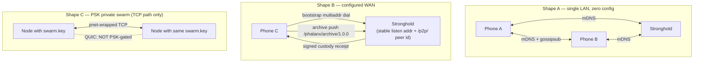

# Phalanx Network — topology, discovery, and the wire as deployed

This document describes the Phalanx mesh as it actually runs: which transports are built, which gossip topics exist
and who listens to them at default configuration, how peers find each other, what the DHT stores, and what delivery
the network does and does not promise. It is written for evaluators deciding whether to deploy Phalanx and for
engineers who will operate or maintain it. Terms like [WitnessEnvelope](architecture.md#glossary),
[Stronghold](architecture.md#glossary), and [MeshSentinel](architecture.md#glossary) are defined in the [architecture
glossary](architecture.md#glossary); trust and identity mechanics are in [trust.md](trust.md); the adversary analysis
is in [threat-model.md](threat-model.md).

Two binaries speak this protocol: the **node** (the phone app via `phalanx-ffi`, or the headless `sentinel` desktop
binary — both use the same transport stack, `crates/phalanx-node/src/network/orchestrator.rs`) and the **Stronghold**
(the wall-powered custody/export daemon, `crates/phalanx-stronghold`). Both construct their swarm through the same
factory (`crates/phalanx-transport/src/factory.rs`), so they share an identical libp2p behaviour set and differ only
in configuration.

## 1. There is no membership layer

Phalanx states this as a design law, not an omission: **anyone can join the swarm.** There is no admission handshake,
no gossiped allowlist, no network password (outside the optional PSK described in §2, which covers one transport
path). Confidentiality comes entirely from payload encryption and per-recipient [grants](architecture.md#glossary) —
never from hiding the mesh or suppressing reachability. A node that cannot be reached cannot be corroborated; a
payload that is encrypted does not care who carries it. ([threat-model.md
§10](threat-model.md#10-unauthorized-mesh-access) records the rationale.)

The same law shapes the topic design. There are only a handful of **static, generic gossipsub topics** (§3) — no
per-community, no per-recording, no dynamic topics. Topic subscriptions are visible to every gossipsub peer, so a
per-community topic would leak the community roster as an anonymity set. Instead, community-scoped traffic (presence
heartbeats, [Silent Canary](architecture.md#glossary) alerts) is published to generic topics as one ciphertext per
community, encrypted with a key derived from the `CommunityId` (`crates/phalanx-node/src/actors/vitals_actor.rs`,
`crates/phalanx-node/src/actors/canary_supervisor.rs`). A canary alert is indistinguishable on the wire from any other
control message.

**What a network observer can learn:** the IP addresses and ports of participating peers; their libp2p PeerIds (stable
pseudonyms); the topic names (static and generic); message sizes and timing; and which PeerId published each gossipsub
message, because every message is signed by the publisher's key (`crates/phalanx-transport/src/builder.rs:161`,
`MessageAuthenticity::Signed` with `ValidationMode::Strict`). Phalanx is **pseudonymous, not anonymity-preserving**:
the linkage between a device's mesh presence and its authorship of evidence is deliberate — it is what makes the
evidence chain attributable.

**What an observer cannot learn:** media content — video and audio payloads are AEAD-encrypted before publish, and a
publish is aborted on encryption failure so plaintext never reaches the mesh
(`crates/phalanx-node/src/actors/media_egress.rs:288-312`); community membership — rosters never appear on the wire,
only per-community ciphertexts; and trust relationships — reputation is local to each device and never gossiped, by
design (see [trust.md](trust.md)).

## 2. Transports

The swarm composes exactly three transports, registered in this order in
`crates/phalanx-transport/src/factory.rs:128-151`:

1. **QUIC** (primary) — native TLS 1.3 encryption and stream multiplexing
   (`crates/phalanx-transport/src/builder.rs:30`).
2. **TCP + Noise + Yamux** (fallback, for UDP-hostile networks) — 20-second upgrade timeout, `TCP_NODELAY` set
   (`crates/phalanx-transport/src/builder.rs:54-131`). On the no-PSK path, if DNS transport initialization fails
   (Android has no `/etc/resolv.conf`), it falls back to plain TCP with a warning — all Phalanx multiaddrs use IP
   addresses, so DNS is not required (`builder.rs:93-129`). On the PSK path the same failure is a hard
   transport-construction error with no fallback (`builder.rs:73`).
3. **Relay client transport** upgraded with Noise + Yamux (`crates/phalanx-transport/src/factory.rs:134-150`).

> **PSK scope — read this precisely.** The optional 32-byte pre-shared key (libp2p `pnet`) wraps **only the TCP
> fallback transport** (`crates/phalanx-transport/src/builder.rs:67`). The QUIC transport and the relay transport are
> never pnet-wrapped (`build_quic_transport` takes no PSK parameter, `crates/phalanx-transport/src/builder.rs:30-37`).
> Consequence: even with `require_psk = true`, QUIC listeners and dials are not gated by swarm membership — QUIC
> connections are TLS-encrypted but open to any dialer. A "private swarm" is therefore private only on its TCP path
> (§8). If `require_psk` is set and no PSK is present, the factory refuses to start
> (`crates/phalanx-transport/src/factory.rs:62-69`). The Stronghold has no PSK configuration surface at all — it
> always builds with `psk: None` (`crates/phalanx-stronghold/src/swarm.rs:22-31`), so a Stronghold cannot participate
> in the pnet-private TCP swarm.

**NAT traversal: present at the behaviour level, not orchestrated.** The composite behaviour includes a relay *server*
(capped at 64 reservations, 4 per peer; 128 circuits, 4 per peer — `crates/phalanx-transport/src/builder.rs:197-203`),
a relay client, DCUtR (hole-punching), and AutoNAT with default config
(`crates/phalanx-transport/src/behaviour.rs:27-45`). However, no production code listens on a `/p2p-circuit` address
or requests a relay reservation — the factory only calls `listen_on` for the configured listen addresses
(`crates/phalanx-transport/src/factory.rs:163`). DCUtR requires a relay reservation to initiate hole-punching, so
**hole-punching does not happen automatically today**. An operator can hand-configure a `/p2p-circuit` multiaddr, but
nothing does it for them. Cross-NAT deployments need explicitly reachable addresses (§8).

**Connection limits are hardcoded**, not configurable: 192 established total, 128 incoming, 64 outgoing, 4 per peer,
64/32 pending in/out (`crates/phalanx-transport/src/builder.rs:232-239`). The `MeshTransportConfig` fields
`max_established`, `max_established_incoming`, and `max_established_per_peer` are read and explicitly discarded with a
comment that they are reserved for future tuning (`crates/phalanx-transport/src/factory.rs:120-126`).
`idle_timeout_secs` (default 60) **is** honored as the swarm idle-connection timeout, and the swarm caps negotiating
inbound streams at 128 (`crates/phalanx-transport/src/factory.rs:154-157`).

**Gossipsub configuration** (`crates/phalanx-transport/src/builder.rs:147-187`): every message is signed by the node's
Ed25519 identity key with strict validation; the heartbeat interval derives from the physics model's RTT constant (200
ms at the `default_wan` τ_rtt of 200, clamped to [100 ms, 30 s] — `crates/phalanx-proto/src/types.rs:221-236`); peer
scoring is enabled with an IP-colocation penalty (weight −5.0 above 3 peers per IP; graylist at −400). The maximum
message size is 2 × `max_chunk_size_bytes`, which differs per binary at compiled defaults: **16,384 bytes on the
node** (`max_chunk_size_bytes = 8192`, `crates/phalanx-node/src/config.rs:240`) vs **262,144 bytes on the Stronghold**
(transport default 131,072, `crates/phalanx-transport/src/config.rs:60`). The node additionally rejects any inbound
gossip message over its own 16,384-byte ceiling before processing
(`crates/phalanx-node/src/actors/meshsentinel.rs:870-879`). At the default bundle size of 1 (one 1,200-byte fountain
symbol per message, §7) everything fits comfortably; the asymmetry only matters if an operator raises
`symbol_bundle_size` near its maximum of 100 without also raising the node's `max_chunk_size_bytes`.

## 3. Topics: who publishes, who listens

All topic names are normalized by `MeshTopic::new` — lowercase, stripped of leading slashes and any existing
`phalanx/` prefix, then re-prefixed `/phalanx/` (`crates/phalanx-proto/src/network/topic.rs:15-23`; a regression test
pins the well-known strings as wire-stable). The table shows behavior **at compiled defaults** — no config file on
either binary.

| Normalized topic | Payload | Publishers | Subscribers (at defaults) |
|---|---|---|---|
| `/phalanx/video/1.0.0` | Encrypted video fountain-symbol bundles | Node `MediaEgress` (`crates/phalanx-node/src/actors/media_egress.rs:186`) | Nodes + Stronghold (`crates/phalanx-node/src/network/orchestrator.rs`, `crates/phalanx-stronghold/src/swarm.rs`) |
| `/phalanx/audio/1.0.0` | Encrypted audio fountain-symbol bundles | Node `MediaEgress` | Nodes + Stronghold |
| `/phalanx/control/1.0.0` | Per-community encrypted presence heartbeats | Node `VitalsActor` (`crates/phalanx-node/src/actors/vitals_actor.rs:183`) | Nodes |
| `/phalanx/revocation/1.0.0` | [RevocationToken](architecture.md#glossary)s, DHT tombstones | Node `EgressActor` (`crates/phalanx-node/src/actors/egress.rs:175-204`) | Nodes + Stronghold (both have inbound handlers: `crates/phalanx-node/src/actors/meshsentinel.rs:886`, `crates/phalanx-stronghold/src/sentinel.rs:153`) |
| `/phalanx/mesh/1.0.0` | Per-community encrypted [Silent Canary](architecture.md#glossary) alerts | Node `CanarySupervisor` (`crates/phalanx-node/src/actors/canary_supervisor.rs:288`) | **nobody — deliberately publish-only** (see below) |

Two footnotes: `/phalanx/discovery/1.0.0` is defined and re-exported (`crates/phalanx-proto/src/network/events.rs:14`)
but never published or subscribed anywhere in the workspace — a dead constant. And the only gossipsub `subscribe`
call in the workspace is the factory loop over `config.subscribe_topics`
(`crates/phalanx-transport/src/factory.rs:174`); there is no runtime topic subscription anywhere, so the table above
is exhaustive.

> **One sharp edge remains.** Canary alerts on `/phalanx/mesh/1.0.0` are **deliberately publish-only**: no inbound
> alert handler exists yet, and `MeshSentinel::handle_data_received` routes unrecognized topics into evidence
> ingestion, so the topic must be subscribed together with its handler — the doc comment on
> `orchestrator::subscribe_topics` records this, and the cross-crate test allow-lists it explicitly so a *new*
> publish-only topic fails the suite. Publishes to a subscriber-less topic increment the `no_peers_subscribed`
> counter (§7); the working canary signal is local detection. (The earlier revocation-override hazard is gone: the
> revocation topic is now profile-pinned, so publish and subscribe cannot be split. Revocation also has a second,
> working path regardless of gossip: a one-shot replay to every newly admitted peer, §4.)

## 4. Discovery and admission

Four discovery mechanisms exist; they are not equivalent, and the difference matters for the admission gate.

| Path | Produces `PeerDiscovered`? | Passes EclipseRouter/TopologyGate admission? | Notes |
|---|---|---|---|
| mDNS (same LAN) | **Yes** — the only libp2p source (`crates/phalanx-transport/src/adapters/libp2p.rs:232-240`) | Yes | Always enabled, no off switch (`builder.rs:194`); only the *first* peer of a discovery batch becomes an event, but *all* batch peers enter the Kademlia routing table (`libp2p.rs:751`) |
| Local mesh (BLE/WiFi-Direct FFI) | Yes (`crates/phalanx-ffi/src/local_mesh.rs:53-58`) | Yes | Radios not implemented — §6 |
| Bootstrap dialing | No | **No — bypasses admission** | Dialed once at swarm construction, best-effort: unparseable addresses silently skipped, dial failures logged (`factory.rs:185-191`) |
| Inbound connections | No | **No — bypasses admission** | |
| Kademlia-routed connections | No | **No — bypasses admission** | |
| identify | No | **No** | Counted for wake attribution only; adds no addresses (`libp2p.rs:730`) |

On the libp2p transport, **only mDNS produces `PeerDiscovered`** — every other swarm event falls through to the
unhandled arm (`crates/phalanx-transport/src/adapters/libp2p.rs:297`). And gossipsub data from *any connected peer* is
processed with no `is_admitted()` check (`crates/phalanx-node/src/actors/meshsentinel.rs:869`). So TopologyGate
admission does **not** gate connectivity. What it gates is the follow-on workflows: Silent Canary reconnect
notification, proximity witness capture, revocation replay to first-seen peers, IWFQ eviction, and the
subnet-distribution input to eclipse fingerprinting (`meshsentinel.rs:928-989`; the fingerprint's peer-set hash and
count sample the wider data-active set — see below). Connection paths that bypass the gate are still bounded by the
swarm-level defenses: the hardcoded connection limits (§2), gossipsub peer scoring with the IP-colocation penalty, and
a per-peer inbound rate limit of 100 events/second in the adapter (drops are counted, not silent — `libp2p.rs:326`,
`libp2p.rs:862`).

For peers that do reach admission, the flow is: `MeshSentinel` sends `TryAdmit` to the **EclipseRouter** actor
(`crates/phalanx-node/src/actors/eclipse_router.rs:59`), which rate-limits processing to 10 discoveries/second
(`crates/phalanx-node/src/actors/mesh_policy.rs:40`) and consults the **TopologyGate**
(`crates/phalanx-forensics/src/verification/topology_gate.rs:191`), which enforces in order: idempotency; a
**subnet-diversity quota of 8 peers per /16 IPv4 bucket** (IPv6 hashes its first 6 bytes; local-mesh peers are exempt
— proximity already limits them); a per-transport-class quota (local mesh gets 25% of capacity by default, clamped
0.1–0.5); and a total capacity of 192 (matching the libp2p connection limit, `mesh_policy.rs:13`). When a quota is
full, IWFQ preemption evicts the lowest-trust, non-anchored peer of strictly lower
[TrustLevel](architecture.md#glossary) in the same transport pool. Admission yields an `AdmissionTicket` with a
private seal field, so only `try_admit` can mint one. Up to 4 peers with reputation ≥ 0.5 are held as **anchors** that
cannot be evicted until demoted. Rejected and evicted peers are actively disconnected (`eclipse_router.rs:272`).

Every 5 minutes the EclipseRouter records a fingerprint combining the **data-active** peer set (hash and count, from
the spectral health tracker — which observes every data-sending peer, admitted or not) with the **admitted** set's
subnet distribution (from the TopologyGate) into a 6-snapshot (30-minute) window
(`crates/phalanx-node/src/actors/eclipse_router.rs:379-399`). Elevated eclipse risk injects a 5.0 Sybil-pressure impulse into the [homeostasis
integrals](architecture.md#glossary); critical risk injects 20.0, records an `EclipseAttempt` offense, and triggers a
re-bootstrap (re-dial bootstrap peers plus a Kademlia random walk — `libp2p.rs:689`) when gate occupancy is below 96.
A reciprocity-floor sweep runs on the same tick, and `peer_first_seen` timestamps are deliberately never removed on
disconnect, so a peer cannot reset its reciprocity grace period by reconnecting (`eclipse_router.rs:292`). Full
adversary analysis: [threat-model.md §5](threat-model.md#5-eclipse-attacks).

One asymmetry to know: the libp2p adapter never emits `PeerDisconnected` (that event exists for connection-oriented
transports like the local mesh), so gate slots for libp2p-admitted peers are reclaimed only by IWFQ eviction or
rejection-disconnect, not by connection close (`libp2p.rs:297`, `crates/phalanx-proto/src/network/events.rs:65-69`).

## 5. The DHT

Kademlia runs in **Server mode unconditionally** — phones included act as DHT servers
(`crates/phalanx-transport/src/builder.rs:189`). Two **provider-record** namespaces are defined
(`crates/phalanx-transport/src/behaviour.rs:13-14`); only one is live at runtime:

- `phalanx/stronghold` — reserved but **unwired**. The behaviour exposes `announce_stronghold` and
  `find_strongholds` (`crates/phalanx-transport/src/behaviour.rs:56-89`), but no production code calls either: the
  only `announce_stronghold` caller is a unit test, `find_strongholds` has no callers, the swarm-task command enum
  has no stronghold variant, and `EgressPort` exposes no such method
  (`crates/phalanx-transport/src/adapters/libp2p.rs:27-45`, `crates/phalanx-proto/src/network/events.rs:152-216`).
  Like the dead `/phalanx/discovery/1.0.0` constant (§3), this is plumbing without a driver. Strongholds are found
  via configured `[[network.archival_peers]]` multiaddrs (§8), not DHT discovery.
- `phalanx/recording/<recording-id>` — the live namespace: any holder of a publishable recording announces itself as a shard provider,
  deduplicated per recording within a 30-second window (`crates/phalanx-node/src/actors/egress.rs:218-232`). Playback
  uses these records to find live shard holders (§7).

Parameters: replication factor 20, query timeout 30 s, record and provider-record TTL both 3600 s
(`crates/phalanx-transport/src/config.rs:65-67`, `crates/phalanx-transport/src/factory.rs:82-85`).

**Node: persistent.** The node uses a redb-backed record store at `{vault}/dht_store.redb` (tables `dht_records` and
`dht_providers` — `crates/phalanx-node/src/persistence/kademlia.rs:17-18`), so its DHT view survives restart. The
store is defensive: every `put` must decode as a `DhtPayload` and verify an embedded signature against the DID in the
record key (`kademlia.rs:63-85`); provider sets are capped at 20 entries with reputation-weighted insertion (a
higher-reputation newcomer evicts the lowest; the local node gets a 1.0 baseline; 24 h fallback expiry only when
libp2p supplies none — `kademlia.rs:267-285`); the `records()`/`provided()` iterators intentionally return empty to
prevent full-table memory mapping; and a pruning sweep deletes expired or corrupt entries. The node also enables
`StoreInserts::FilterBoth` so inbound records pass validation before storage
(`crates/phalanx-node/src/network/orchestrator.rs:44`).

**Stronghold: ephemeral.** The Stronghold uses libp2p's in-memory store (`crates/phalanx-stronghold/src/swarm.rs:33` →
`crates/phalanx-transport/src/factory.rs:32`) and explicitly disables `FilterBoth`. After a Stronghold restart its
local DHT state is empty, and its custody is re-advertised only as new archive pushes arrive — there is no boot-time
re-announce sweep of previously held recordings (`crates/phalanx-stronghold/src/sentinel.rs:293`). Its evidence on
disk survives (the filesystem `EvidenceStore` is durable); only the DHT *advertisement* of it lapses.

One neutral production-checklist item: `withdraw_provider` (used by revocation's `WithdrawProvider` command) is a
default no-op that the libp2p egress does not override, so local DHT provider records for revoked recordings age out
by TTL rather than being actively withdrawn (`crates/phalanx-proto/src/network/events.rs:191-195`,
`crates/phalanx-transport/src/adapters/libp2p.rs:1234`).

## 6. Local mesh (BLE / WiFi Direct)

The integration seam exists; the radios do not. State of the code:

- **Rust side: complete and wired.** Flutter is designed to own the radio stacks (CoreBluetooth, Android BLE GATT,
  WiFi Direct) and bridge them through C-ABI functions: `phalanx_local_mesh_push_peer_discovered`,
  `push_data_received`, `push_peer_disconnected`, an outbound poll, and an availability toggle
  (`crates/phalanx-ffi/src/local_mesh.rs`). The `LocalMeshAdapter` (channel capacity 64) is constructed in the FFI
  engine bootstrap (`crates/phalanx-ffi/src/handle.rs:570`). BLE mutual authentication scaffolding also exists: a
  4-message Ed25519 challenge/response (32-byte nonce; signature over `responder_did || challenger_did || nonce`)
  exposed via `phalanx_sign_ble_challenge` / `phalanx_verify_ble_peer` (`crates/phalanx-ffi/src/ble_auth.rs`).
  Local-mesh peers carry `TransportClass::LocalMesh`, exempting them from the subnet-diversity check but subjecting
  them to the 25% local-mesh transport quota (§4).
- **Radio side: not implemented.** `flutter_app/pubspec.yaml` declares no BLE or WiFi-Direct plugin, and no Dart code
  references any `phalanx_local_mesh_*` function. In the shipped app the local-mesh transport never becomes available;
  the desktop `sentinel` binary explicitly injects `local_mesh: None` (`crates/phalanx-node/src/bin/sentinel.rs:116`).

Read any "BLE / WiFi Direct" transport claim in the README accordingly: the Rust engine is ready to accept a
local-mesh transport pushed in from platform code, and the admission, authentication, and quota logic for it is built
and tested — but no radio implementation ships today. Off-grid phone-to-phone operation currently requires a shared IP
network (§8).

## 7. Delivery semantics

Gossip is **best-effort**. Phalanx does not promise that any given message reaches any given peer; delivery is
redundancy-probabilistic, and the redundancy comes from **fountain coding, not retransmission**. Each sealed
[WitnessEnvelope](architecture.md#glossary) is RaptorQ-encoded (`crates/phalanx-node/src/actors/media_egress.rs:243`)
into symbols of 1,200 bytes (default `symbol_size`) with a default `repair_ratio` of 1.5 — 50% extra repair symbols —
and published in bundles of `symbol_bundle_size` symbols per gossipsub message (default 1, maximum 100; bundling
amortizes the per-message Ed25519 signing cost). A receiver reconstructs the envelope from **any sufficient subset**
of symbols; completeness is decided by the receiving decoder ([ShardMold](architecture.md#glossary)), never by
sender-declared counts. Losing some fraction of messages is the expected operating condition, not a failure.

**Publish failures are silent at the API and loud in the counters.** `EgressPort::publish` returns `Ok(())` as soon as
the command is enqueued to the swarm actor; actual `gossipsub.publish()` errors inside the swarm task surface only via
`tracing::error!` plus always-on atomic counters (`crates/phalanx-transport/src/adapters/libp2p.rs:165-170`, `:491`).
The per-variant breakdown (`PublishErrorCounters`, `libp2p.rs:117-138`) counts `duplicate`, `signing_error`,
`no_peers_subscribed`, `message_too_large`, `transform_failed`, and `all_queues_full` — the match is exhaustive, so a
libp2p upgrade that adds a variant is a compile error. These counters are not just diagnostic: the sentinel and FFI
bootstraps wire dropped-event and socket counters into the `SystemGovernor`, so transport loss feeds the [Volterra
homeostasis integrals](architecture.md#glossary) (`crates/phalanx-node/src/bin/sentinel.rs:104-113`).

**The publisher's own evidence is crash-safe.** When a bundle publish fails, each symbol is individually persisted to
the **OutboundQueue** — a WAL-backed FIFO with a 16 MiB hard cap, abandonment after 10 attempts, and recovery from
disk on restart (`crates/phalanx-node/src/persistence/outbound.rs`). Its byte count feeds the storage-pressure
integral, which lowers capture FPS so queue growth self-regulates. Re-publishing recovered entries is safe: an entry
enters the WAL only because the original publish failed — it never reached the mesh — and even a genuinely redundant
symbol is harmless, because the fountain decoder accepts any sufficient subset and ignores extras. (Gossipsub
deduplication is *not* the mechanism: no custom `message_id_fn` is configured, so a re-publish carries a fresh
message id — `crates/phalanx-transport/src/builder.rs:153-163`.)

**[PendingEgress](architecture.md#glossary) is narrower than it sounds**: it schedules retry of retrieval *responses*
only (channel id + response). The `EgressActor` retries on a 500 ms tick with backoff 500 ms × 2^attempts, abandons
after 3 attempts, and caps the queue at 64 entries, shedding oldest (`crates/phalanx-node/src/actors/egress.rs:80`,
`:302-334`). Even a successful retry depends on the libp2p response channel still being alive — the adapter
garbage-collects captured channels after 30 s (past the 20 s request timeout), counting evictions in
`response_channels_lost` (`libp2p.rs:471-481`). On shutdown the pending queue is drained into the
[TransientJournal](architecture.md#glossary) (`EmergencySalvage`) and seeded back into the new `EgressActor` on the
next boot (`crates/phalanx-node/src/actors/meshsentinel.rs:1095`, `:314`).

**Backpressure is counted loss, never blocking.** The event channel (capacity 2048) uses `try_send` and counts
overflow drops; per-peer rate-limit drops count into the same counter; `MeshSentinel` drops inbound chunks when the
bandwidth scaler falls below 0.05 or the ingestion channel is full, recording memory pressure instead of blocking
(`meshsentinel.rs:898-922`). When an inbound request event is dropped, its response channel is deliberately dropped
with it so the remote side gets a clean timeout — documented in-code as correct behavior under backpressure
(`libp2p.rs:873`).

**What offline peers miss, and how data survives anyway.** There is no mesh-level store-and-forward for offline
*recipients*: gossipsub messages missed while offline are gone from the pub/sub layer. Data survives through three
pull/push paths instead:

1. **Directed archive push** — the node pushes a recording's shards to configured Strongholds over
   `/phalanx/archive/1.0.0` (request/response, 20 s timeout) and receives a signed [custody
   receipt](architecture.md#glossary); `target_replica_count` — profile-pinned (1 for `community_with_stronghold`, 2
   for `high_risk_cross_border`) — is the policy threshold for distinct custody replicas. Directed sends are connection-gated — pushes to unconnected peers are rejected with only a tracing
   warning — which is why the node dials its archival peers at startup (`crates/phalanx-node/src/config.rs:130`,
   `libp2p.rs:640`).
2. **Pull-based retrieval** — `PlaybackCoordinator` queries the DHT for recording providers and requests shards
   directly from live holders over `/phalanx/retrieval/1.0.0` (`meshsentinel.rs:991-1014`).
3. **Revocation replay** — the first time a peer is admitted, all persisted revocation tokens are re-broadcast so
   partitioned devices catch up on deletions (`meshsentinel.rs:981-988`).

## 8. Deployment shapes

**Shape A — single LAN, zero config.** Two or more devices on the same network discover each other via mDNS (always
on), pass admission, and exchange media over the default gossipsub topics. Phone-to-phone works out of the box because
both phones default to the same topic strings. A default-configured Stronghold on the same LAN is discovered
and — because every profile projects the same topics and `protocol_version` (§3, §5) — receives gossiped media and
shares the node's Kademlia DHT at defaults. Custody receipts and export grants still require the directed archive
push, which requires Shape B's config block on the phones.

**Shape B — configured WAN.** Cross-network operation needs explicit addresses: the node's `bootstrap_peers` (and/or
`[[network.archival_peers]]` blocks) carry dialable multiaddrs. For archive push the multiaddr **must** end in
`/p2p/<peer-id>` — that tail is the push target, and without it `ArchivalPeer::peer_id()` returns `None`
(`crates/phalanx-node/src/config.rs:104-121`). The Stronghold should be given a stable listen address; note its
default is **TCP-only** (`/ip4/0.0.0.0/tcp/0`, `crates/phalanx-stronghold/src/config.rs:126`) — it can dial out over
QUIC but accepts inbound QUIC only if you add a `quic-v1` listen address. There is no automatic NAT traversal (§2), so
at least one side of every connection needs a reachable address.

**Shape C — PSK private swarm.** Place the same raw 32-byte `swarm.key` at `{base}/swarm.key` on each node
(`crates/phalanx-node/src/paths.rs:99`, loaded by `crates/phalanx-node/src/psk.rs:8`; a wrong-length key is logged and
ignored, and the node proceeds as a public swarm — set `require_psk = true` to make that a startup failure instead).
The sentinel logs "Joining Private Swarm" vs "Joining Public Swarm" accordingly. **Scope caveat (§2): the PSK gates
only the TCP path.** QUIC listeners remain open to any dialer, and the Stronghold cannot join a PSK swarm at all. A
PSK swarm whose nodes still listen on QUIC is private in name only; treat the PSK as defense-in-depth for TCP-only
deployments, not as a membership layer.

**Minimum viable mesh, honestly:**

| Deployment | What works | What does not |
|---|---|---|
| 1 phone alone | Capture, verification gates, encrypted local [Guardian](architecture.md#glossary) vault, signed envelope chain; failed publishes queue to the outbound WAL (16 MiB, 10 attempts) | No replication, no corroboration, no custody; publishes count `no_peers_subscribed` |
| 2 phones, same LAN | mDNS discovery + admission, gossiped media exchange, presence heartbeats, Silent Canary detection (local only — the alert broadcast has no default receivers, §3), pull retrieval between phones | No durable custody, no export; canary *alerts* are not received (§3); both devices are seizable |
| Phones + Stronghold | Directed archive push + signed custody receipts + autonomous C2PA export — **requires** `[[network.archival_peers]]` with a `/p2p/` tail on each phone (and `stronghold_did` for export grants) | Gossiped media to the Stronghold (defaults mismatch, §3); shared DHT (defaults mismatch, §5) — both fixable in config |
| Cross-network | Everything above, given bootstrap/archival multiaddrs and one reachable address | Zero-config discovery (mDNS is LAN-only); automatic NAT traversal (relay/DCUtR present but unorchestrated) |

## 9. Config truth table

**Node** config is now a topology selector: a `profile = "<name>"` line plus optional `[instance.*]` tables. It loads
from the TOML path in the `PHALANX_CONFIG` env var. If the variable is unset, the default profile (`solo_device`) is
used and logged (the normal mobile path — Flutter supplies settings via FFI). **If the variable is set but the file
fails to load, parse, or cohere, the node now fails loudly** — `load_from_env` returns an error and the sentinel
aborts (`crates/phalanx-node/src/config.rs`, `crates/phalanx-node/src/bin/sentinel.rs`); the old silent fall-back to
compiled defaults is gone. All sections use `#[serde(deny_unknown_fields)]`, and the coherence-critical values are
**profile-pinned and structurally absent from the `[instance]` tables**, so a pinned key (e.g. `protocol_version`)
under `[instance.network]` is a parse error, not a silent desync.

Profile-pinned network values (from `DeploymentProfile`; not operator-settable):

| Value | Source | Notes |
|---|---|---|
| `protocol_version` | `DEFAULT_PROTOCOL_VERSION` = `/phalanx/1.1.0` | Feeds identify + the Kademlia protocol id; identical node/Stronghold (§5) |
| `max_chunk_size_bytes` | `DEFAULT_MAX_CHUNK_SIZE_BYTES` = 131072 | Gossipsub ceiling = 2×; inbound oversize reject — pinned so peers don't drop each other's frames |
| `video_topic` / `audio_topic` / `control_topic` / `revocation_topic` | canonical `MeshTopic` constructors | Exact-match gossipsub strings; pinned identically on every peer |
| `require_psk` | profile PSK posture | `solo_device`/`community_with_stronghold` → optional; `affinity_group_lan`/`high_risk_cross_border` → required |
| `target_replica_count` | profile replica policy | 0 (solo, affinity) / 1 (community) / 2 (high-risk); custody-replica policy threshold |

Operator-tunable `[instance.network]` fields (all defaulted; a bare `profile = "..."` file is valid):

| Field | Default | Notes |
|---|---|---|
| `bootstrap_peers` | `[]` | Dialed once, best-effort |
| `repair_ratio` | 1.5 | Fountain-code redundancy (self-describing on the wire via the OTI — safe to tune) |
| `symbol_size` | 1200 B | Self-describing via the OTI |
| `symbol_bundle_size` | 1 | Max 100; self-describing |
| `listen_addresses` | QUIC + TCP on 0.0.0.0, ephemeral ports | |
| `archival_peers` | `[]` | `address` (with `/p2p/` tail) + optional `stronghold_did`; a missing `/p2p/` tail is a hard coherence error |

The dead `[network]` knobs that the old flat schema parsed and never read — `cleanup_interval_secs`,
`guardian_service_key`, `max_connections` — have been removed.

Operator-tunable `[instance.storage]` fields with network-relevant effect: `vault_path` (dev default `./sim_vault` is
replaced by the sentinel with `{base}/vault`; explicit values are kept), `max_storage_bytes` (1 GB),
`max_foreign_storage_bytes` (500 MB), `max_foreign_per_owner_bytes` (50 MB) — all hard-enforced caps on mesh-received
evidence — and `evidence_ttl_secs` (300), which gates ingestion. The dead storage knobs `max_peers`,
`stale_session_threshold`, and `shards_needed_to_archive` have been removed.

Environment variables:

| Variable | Binary | Behavior |
|---|---|---|
| `PHALANX_CONFIG` | node/sentinel | TOML path (`profile` + `[instance]`); unset ⇒ default profile (logged); set-but-invalid ⇒ loud abort (above) |
| `PHALANX_IDENTITY_PASSPHRASE` | sentinel, stronghold CLI | **Mandatory** — sentinel refuses to start without it (`bin/sentinel.rs:58`); stronghold CLI likewise (`bin/stronghold.rs:653`); the GUI pre-fills from it but tolerates absence |
| `PHALANX_HOME` | sentinel | Overrides the entire state base dir; else `ProjectDirs("app","Phalanx","phalanx-sentinel")` local data dir; refuses to fall back to the working directory (`paths.rs:26-74`) |
| `PHALANX_STRONGHOLD_HOME` | stronghold | Data-root precedence: `--data-dir` flag > this var > explicit non-default config `vault_path` > platform dir; fails loudly otherwise (`crates/phalanx-stronghold/src/paths.rs:35-55`) |

**Stronghold** config uses the same `profile` + `[instance]` schema and loads from `--config` (default
`stronghold.toml`). A **missing** file falls back to the default Stronghold profile (`community_with_stronghold`) with
a printed notice; a **present-but-invalid or incoherent** file is a hard error — the same loud polarity as the node.
A `stronghold.toml` whose profile has no Stronghold role (e.g. `solo_device`) is rejected with a named error
(`ProfileHasNoStrongholdRole`). After assembly, `custody_ttl_secs` is clamped up to a 60-second floor with an operator
warning. Operator-tunable `[instance]` fields and defaults: `[instance.network]` `listen_addresses`
(`["/ip4/0.0.0.0/tcp/0"]` — TCP-only ephemeral, §8; flagged with a warning under an inbound-reachable profile),
`bootstrap_peers` (`[]`); `[instance.storage]` `max_storage_bytes` (100 GiB), `max_per_community_bytes` (20 GiB),
`max_bytes_per_owner` (2 GiB), `owner_fair_share_ratio` (0.25), `custody_ttl_secs` (604,800 s = 7 days),
`export_quiescence_secs` (120; 0 disables autonomous export), `export_path` (`{vault}/exports` when unset),
`release_custody_after_export` (false); `[instance.corroboration]` `min_overlap_ms` (5000), `divergence_alpha` (0.05),
`c2pa_cert_path`/`c2pa_key_path` (optional; both set ⇒ exports signed with the on-disk certificate). The topics and
`protocol_version` are **profile-pinned** — projected from the same `DeploymentProfile` as the node, so the two
binaries cannot drift (§3, §5). Identity is Argon2-sealed at `{vault}/stronghold_identity.bin`; first run generates
via `PhalanxIdentity::new_ephemeral()` and seals to disk.

Finally, the transport-internal `AdapterConfig` (event channel capacity 2048, 100 events/peer/sec rate limit, optional
poll cadence for power management) is not exposed in either binary's config file — both use its defaults
(`crates/phalanx-transport/src/adapters/libp2p.rs:326-337`).
