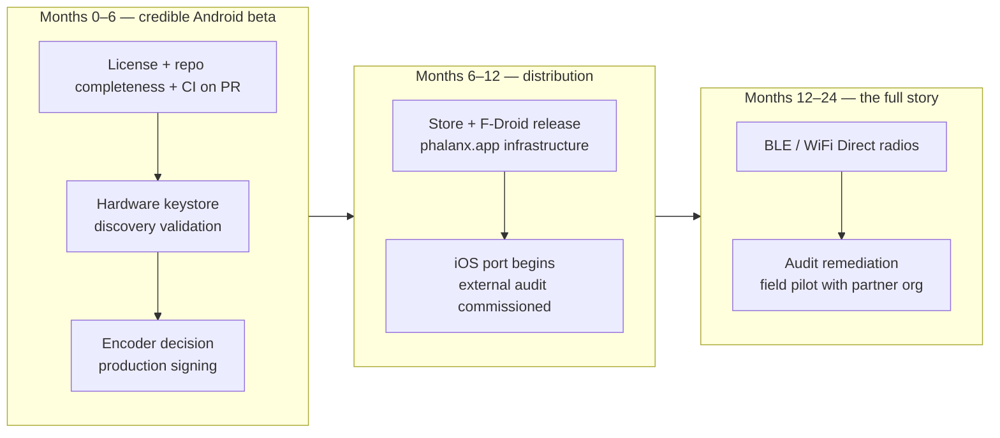

# Phalanx Stewardship — status, claims, invariants, and handoff

This is the due-diligence dossier for anyone considering taking responsibility for Phalanx: a prospective
maintainer, a deploying organization's evaluator, or a funder deciding what their money buys. It answers four
questions the marketing material cannot: **what is real, what is scaffolding, what must not be broken, and what
remains to be built.** It assumes you have read [architecture.md](architecture.md) (system overview and
[glossary](architecture.md#glossary)), and it cross-references [network.md](network.md),
[trust.md](trust.md), and the [threat model](threat-model.md) rather than repeating them.

---

## 1. Why this document

Phalanx is a solo build ([PITCH.md § Background](../PITCH.md)). The design work is dense — cryptography, control theory, distributed
systems, and signal processing in one workspace — and the original author cannot be the permanent single point of
failure for a system whose entire purpose is eliminating single points of failure. The project needs stewards.

A steward inherits three kinds of artifact, and the worst handoff failures come from confusing them:

1. **Load-bearing invariants** — code whose *ordering and absence* are the security property. Several look like
   bugs to a fresh reviewer ("why isn't this verified before it's written to disk?", "why doesn't revocation
   re-verify the envelope?"). Each has been audited, has a documented rationale, and breaks something specific if
   "fixed." They are catalogued in §4.
2. **Inherited intent** — implemented, tested code that no production path calls yet. It is not rot; it documents
   a deployment shape that was designed but never assembled. Each item needs a deliberate wire-it-or-delete-it
   decision, not silent deletion by a dead-code sweep. Catalogued in §5.
3. **Honest gaps** — things that do not exist yet (radio implementations, an iOS app, a license file), stated
   plainly in the README status banner. Catalogued in §2, §6, and §7.

Section 3 — the claims-to-evidence registry — is the table this document exists for. Every headline claim is
classified by the strongest artifact that actually backs it.

## 2. Maturity table

Status vocabulary: **Production** (runs in the default build and is exercised by `cargo test --workspace`);
**Feature-gated** (complete but compiled out by default); **Dormant** (built and tested, never enabled by any
production caller); **Seam only** (the Rust side of an interface exists, the other side does not);
**Deferred** (type or stub exists, logic does not); **Manual-only** (works, but no automation runs it).

| Capability | Status | Anchor |
|---|---|---|
| Capture → [LensGate](architecture.md#glossary) → encrypt → sign → shard → gossip pipeline | Production | `crates/phalanx-node/src/actors/media_egress.rs:184-217` |
| Inbound gauntlet (bloom filter, disk-first persistence, promotion gates) | Production | `crates/phalanx-node/src/actors/storage.rs:620-686` |
| QUIC transport (TLS 1.3) + TCP/Noise fallback | Production | `crates/phalanx-transport/src/builder.rs:25-54` |
| Trusted communities (quorum vouching, expiry, dissolution) | Production | `crates/phalanx-proto/src/identity/community.rs:73-286` |
| Cryptographic forgetting (key destroyed before data) | Production | `crates/phalanx-node/src/persistence/vault/mod.rs:535-568` |
| BIP-39 recovery + manifest enumeration (Rust engine) | Production; Dart bridge has no recovery bindings | `crates/phalanx-proto/src/evidence/envelope.rs:88-112`, `flutter_app/lib/ffi/phalanx_bridge.dart:294-422` |
| Spectral observer (runtime Byzantine detection, threshold 0.3) | Production — **not** feature-gated | `crates/phalanx-node/src/vitals/spectral.rs:1-66` |
| [Stronghold](architecture.md#glossary) CLI binary (always built with `software-transcode`) | Production | `crates/phalanx-stronghold/Cargo.toml:11-13,26` |
| Stronghold GUI | Feature-gated (`gui`, non-default) | `crates/phalanx-stronghold/Cargo.toml:15-18,76-78` |
| C2PA export on mobile | Feature-gated (`software-transcode`, OFF in **every** mobile build path) — every current mobile artifact returns `NoEncoder` (-23) | `crates/phalanx-ffi/src/export.rs:232-237`, `crates/phalanx-ffi/Cargo.toml:45-52` |
| Compile-time contractivity assertion (stability certificate) | Feature-gated (`stability-analysis`, non-default, never enabled in CI) | `crates/phalanx-node/src/lib.rs:73-78`, `.github/workflows/ci.yml:33-37` |
| Lean 4 proofs | Manual-only (`lake build`; no CI job) | `.github/workflows/ci.yml:1-157`, `proofs/lakefile.lean` |
| BLE / WiFi Direct local mesh | Seam only — no Dart/Kotlin/Swift radio code exists and the Dart bridge does not bind the seam. The Rust side is a hardened trust boundary, not bare plumbing: `phalanx_ble_verify_and_admit` emits a LocalMesh peer — hence a `ProximityWitness` — only after a recording/time-bound Ed25519 handshake, a freshness window, a single-use nonce, and a per-window anti-sybil cap, and authenticated proximity is sealed into signed `Evidence::Proximity` that a Stronghold folds into the corroboration proof | `crates/phalanx-ffi/src/local_mesh.rs:60-184`, `crates/phalanx-node/src/actors/media_egress.rs:286`, `crates/phalanx-ffi/src/ble_auth.rs` |
| `DualPresence` offense (same DID at incompatible network locations) | Deferred — offense type and 50-point penalty exist; detection logic does not | `crates/phalanx-proto/src/identity/trust.rs:22`, `crates/phalanx-forensics/src/trust/evaluation.rs:9`, `threat-model.md:365` |
| Android app | Functional dev build: fixed dev passphrase, debug signing config, screen-on capture only (deliberate — no background service), synthetic 25 °C thermal feed | `flutter_app/lib/main.dart:58-62,249-263`, `flutter_app/android/app/build.gradle:57-61`, `flutter_app/android/app/src/main/AndroidManifest.xml:18-75` |
| iOS app | Rust static lib cross-compiles (CI builds `aarch64-apple-ios`); loader expects static linkage; no iOS runner project is tracked | `.github/workflows/ci.yml:86-105`, `flutter_app/lib/ffi/library_loader.dart:8-18`, `flutter_app/ios/build_rust.sh:10` |

The Android dev-build items are production-checklist work, not alarms — they are TODO-marked placeholders in a
pre-release app (`flutter_app/lib/main.dart:58-61`). They appear again in §7 with effort attached.

## 3. Claims-to-evidence registry

Classification ladder, strongest to weakest:

- **Machine-checked** — a proof assistant verified it. Exactly one development qualifies.
- **Numerically certified** — a numerical computation (SDP-derived Lyapunov matrix + exhaustive grid evaluation)
  certifies it. This is a strong artifact and it is *not* a formal proof; do not call it one.
- **Simulation-tested** — asserted by the `phalanx-sim` suites, which run real actor constellations over a
  virtual transport with injectable Byzantine chaos modes (`crates/phalanx-sim/src/harness.rs:548-676,940-968`).
- **Code-anchored mechanism** — the mechanism exists and is unit/integration tested, but the headline *property*
  has no separate certificate.
- **Asserted** — a narrative consequence of the design with no dedicated artifact.

| README claim | Classification | Evidence | Caveats |
|---|---|---|---|
| Shard-order-independent reconstruction, "formally proven in Lean 4" (README § Capabilities) | **Machine-checked** | `recording_order_independent` (`proofs/Phalanx/MoldCommutativity.lean:263-270`) | See "The Lean development, precisely" below |
| "Certified stability" (README § Capabilities) | **Numerically certified** | `crates/phalanx-node/src/stability/contractivity.rs:328-407` | A numerical certificate, not a formal proof — the README says so itself. See below |
| "Self-healing" (README § Emergent Properties) | **Numerically certified** consequence + **simulation-tested** | `contractivity-proof.md:89-104`; `scenario_2_burst_recovery`, `scenario_8_full_recovery_from_critical` (`crates/phalanx-sim/tests/scenarios.rs`) | Derived from contractivity ("not an engineered behavior"), then observed in sim |
| "Byzantine peer detection" — nodes that lie are exposed by behavioral consistency checks (README § Capabilities) | **Code-anchored** (runtime) + **numerically certified** (offline) | Runtime: `crates/phalanx-node/src/vitals/spectral.rs:1-66`; offline: the `stability-analysis` Jacobian model | Two distinct artifacts — runtime detection vs the offline certificate; see below |
| "Every envelope is signed and verified" (README § Security Posture) | **Code-anchored** | `crates/phalanx-forensics/src/pipeline/witness.rs:34-75`, promotion chain `crates/phalanx-forensics/src/verification/gate.rs:538-585` | `promote_signed` is a signature-only path for archive replay (still verifies the signature; skips freshness/continuity) |
| "Encrypted in transit and at rest" (README § Security Posture) | **Code-anchored** | See "The encryption layering, precisely" below | The in-transit outer layer is QUIC TLS 1.3, not XChaCha20 — see below for the full layering |
| "Compile-time evidence integrity" (README § Capabilities) | **Code-anchored**, with CI-enforced negative tests | `ForensicUnit` typestate + five `compile_fail` doc-tests (`crates/phalanx-forensics/src/unit.rs:14-61`) | The doc-tests are the executable proof the typestate cannot be forged from outside the crate |
| "The encryption key is destroyed before the data is removed" (README § Capabilities) | **Code-anchored** | `Guardian::revoke_recording` (`crates/phalanx-node/src/persistence/vault/mod.rs:535-568`); ghost-key cleanup after partial crash (`crates/phalanx-node/src/actors/storage.rs:301-325`) | |
| "The pipeline adapts frame rate to device load" (README § Capabilities) | **Code-anchored** | `target_fps(base: Fps, power: PowerState) -> Fps` — Normal=base, Conserving=½, Leaf=⅕, Dormant=0 (`crates/phalanx-node/src/hardware/camera.rs:40-46`) | Policy-layer threshold at the integral-to-actor boundary, by design |
| "Trusted communities" (README § Capabilities) | **Code-anchored** | Validated `Quorum` newtype, external-voucher counting, `dissolve()` consumes self with `Zeroize` (`crates/phalanx-proto/src/identity/community.rs:73-286`) | |
| Mesh "over QUIC and TCP", with a Bluetooth/WiFi-Direct seam "not yet implemented" (README § Capabilities) | QUIC **code-anchored** | QUIC: `crates/phalanx-transport/src/builder.rs:25-48` | The README already marks the radios unimplemented; the BLE/WiFi-Direct seam is "seam only" (§2) — no radio code in any language |
| "Sybil resistance with diminishing returns" (README § Emergent Properties) | **Simulation-tested** | `scenario_4_sybil_attack_endowment_shrink` (`crates/phalanx-sim/tests/scenarios.rs:365-412`); `rapid_identity_churn_does_not_exhaust_resources` (`crates/phalanx-sim/tests/adversarial_tests.rs:574`) | Mechanism root: quadratic-denominator endowment (`crates/phalanx-node/src/vitals/governor.rs:778-786`) |
| Replay defense ([threat model §3](threat-model.md)) | **Code-anchored** + **simulation-tested** | `crates/phalanx-forensics/src/verification/bloom.rs:68-112`; `bloom_replay_detection_blocks_duplicates`, rotation survival, WAL re-seeding (`crates/phalanx-sim/tests/adversarial_tests.rs:71-95`) | Empirical FPR < 1% at 10k insertions is itself a test (`bloom.rs:187-213`) |
| Eclipse resistance ([threat model §5](threat-model.md)) | **Simulation-tested** | `eclipse_attack_limited_by_subnet_diversity` (`crates/phalanx-sim/tests/adversarial_tests.rs:280`) | |
| Evidence survives Byzantine peers | **Simulation-tested** | Five tests: silent / corrupting / forging / colluding peers + forgery rejected at all k (`crates/phalanx-sim/tests/evidence_byzantine_tolerance.rs:186-399`) | |
| "Adaptive resource management" / homeostasis (README § Capabilities) | **Simulation-tested** | Scenario suite 1–8 (`crates/phalanx-sim/tests/scenarios.rs:77-521`) | Numbering skips scenario 7 |
| Sensor fingerprinting; "Honesty is cheap, dishonesty is expensive" (README § Emergent Properties) | **Code-anchored mechanism** | Mandatory `ForensicMetrics` on every shard (`crates/phalanx-proto/src/evidence/envelope.rs:114-192`); LensGate before encryption (`crates/phalanx-node/src/actors/media_egress.rs:268-286`) | Specific detector thresholds are doc-asserted, not separately tested |
| "Anticipatory memory pressure" (README § Emergent Properties) | **Asserted** (design-modeled) | Jacobian M-row commentary (`crates/phalanx-node/src/stability/jacobian.rs:118-138`) | The same file zeroes `J[M,W]` — the coupling is threshold-activated, not proportional; partial sim coverage via scenario 3 isolation tests |
| "Natural load shedding order", "Load balancing without a balancer", "Rejections regulate throughput", "Peer loss identifies at-risk data" (README § Emergent Properties) | **Asserted** | Narrative consequences of the coupled-integral design (README § Emergent Properties) | Partial, indirect sim coverage (multi-vector stress, reciprocity-floor black-hole detection); no dedicated artifact maps to each claim. Honest status: asserted |

### The Lean development, precisely

The repository contains exactly one project Lean source file: `proofs/Phalanx/MoldCommutativity.lean`
(toolchain `leanprover/lean4:v4.16.0`, mathlib pinned — `proofs/lean-toolchain:1`, `proofs/lakefile.lean:4-15`).
It proves five theorems building to one result: `insert_comm`, `ownership_comm`, `ingest_comm`,
`ingest_all_perm_eq`, and the headline `recording_order_independent`
(`proofs/Phalanx/MoldCommutativity.lean:139-270`) — assembling any permutation of a non-conflicting shard list
yields the identical Recording. Scope limits a steward must know:

- `Recording` and `assemble` are **axiomatized**, not defined (`MoldCommutativity.lean:119-129`); determinism of
  `assemble` is assumed, and the Rust implementation (`crates/phalanx-forensics/src/pipeline/crucible.rs:473`)
  is not modeled.
- Admission (DID checks, signature gates) is explicitly factored out as per-shard and order-independent
  (`MoldCommutativity.lean:16-19,102-117`).
- The Rust↔Lean correspondence is **by-hand mirroring** — the Lean header says "Mirrors: …crucible.rs
  RecordingAmalgam" (`MoldCommutativity.lean:1-20`) — with no mechanical extraction and no conformance test
  linking the two. If `crucible.rs` drifts, nothing turns red.
- CI never builds the proofs (`.github/workflows/ci.yml:1-157`).

This is the **only** machine-checked artifact in the repository. The README scopes its "formally
proven" language to exactly this theorem; every other certification is weaker, detailed next.

### The contractivity certificate, precisely

The stability result is a **numerical certificate**: an SDP (CVXPY/Clarabel, run externally and documented in
[contractivity-proof.md](contractivity-proof.md)) produced a Lyapunov matrix `P`, embedded verbatim as
`LYAPUNOV_P` (`crates/phalanx-node/src/stability/config.rs:176-182`, condition number 214). A Rust `const`
assertion then verifies `Q = P·J_n + J_nᵀ·P` is negative-definite via const-fn Cholesky at all 15,552 grid
vertices, at compile time (`crates/phalanx-node/src/stability/contractivity.rs:328-407`); the e-direction gap is
closed by a Temple–Kato eigenvalue perturbation bound checked at test time (`contractivity.rs:15-23`).

The certificate's three stated code prerequisites (`contractivity-proof.md:13-18`) are **all landed**:

| Prerequisite | Status | Anchor |
|---|---|---|
| Quadratic-denominator endowment ψ_max/(1+(k·e)²) | Landed | `crates/phalanx-node/src/vitals/governor.rs:778-786`, mirrored in `crates/phalanx-stronghold/src/governor.rs:179-187` |
| Unit normalization (each integral scaled by its critical threshold) | Landed | `SCALES` and `build_jn` (`crates/phalanx-node/src/stability/contractivity.rs:56-77,158-256`) |
| M–W coupling removed (threshold-activated, not proportional) | Landed | `crates/phalanx-node/src/stability/jacobian.rs:135-138` |

The entire stability module — including the compile-time assertion — sits behind the
**non-default** `stability-analysis` feature (`crates/phalanx-node/src/lib.rs:73-78`,
`crates/phalanx-node/Cargo.toml:67-68`); `cargo build --workspace` does not evaluate the proof and CI never
enables the feature. A drift-guard test (`test_const_config_matches_runtime`, `contractivity.rs:419-449`) exists
but only runs under the same feature. A steward should put `-p phalanx-node --features stability-analysis` in CI
on day one.

### The Byzantine-detectability claim, precisely

The Byzantine-detectability story rests on two distinct artifacts. The **runtime**
mechanism is the spectral observer: three residual consistency checks against the coupled-integral model, per
peer, anomaly threshold 0.3, in production with no feature gate (`crates/phalanx-node/src/vitals/spectral.rs:1-66`,
[threat model §6](threat-model.md)); it is simulation-tested (`test_phase3_shield_wall_lying_peer_triggers_spectral_anomaly`,
`crates/phalanx-sim/tests/simulation_tests.rs`). The **offline** Jacobian analysis is the feature-gated stability
module above. Detection in deployed nodes comes from the former; the latter justifies why faked signals are
internally inconsistent. The README keeps these separate: runtime behavioral checks under
§ Capabilities, the offline certificate under "Certified stability".

### The encryption layering, precisely

The precise layering behind "encrypted in transit and at rest" — four distinct mechanisms,
verified in source:

1. **Payload layer** — every media payload is AEAD-encrypted with XChaCha20-Poly1305 under the per-recording
   [DEK](trust.md#2-the-key-hierarchy) *before* signing (`PayloadCipher::apply_encryption`,
   `crates/phalanx-forensics/src/verification/judge.rs:46-71`). This layer travels in transit and persists at rest.
2. **At-rest layer** — persisted envelopes are framed and encrypted again in the recording log under the
   resolved content key (`crates/phalanx-node/src/persistence/vault/recording_log.rs:88-124`); keyring, WAL, and
   metadata files are sealed under a salted, BLAKE3-derived vault key
   (`crates/phalanx-node/src/persistence/vault/crypto.rs:13-30`). Both are XChaCha20-Poly1305.
3. **Grant layer** — sharing seals the 32-byte recording key under an X25519-ECDH-derived key with
   XChaCha20-Poly1305, with the sender DID and permissions bound into the AAD so permissions cannot be flipped
   in flight (`crates/phalanx-forensics/src/cryptography/grant.rs:29-81`).
4. **Transit outer layer** — libp2p QUIC's native TLS 1.3, with TCP+Noise as fallback
   (`crates/phalanx-transport/src/builder.rs:25-54`). This is *not* XChaCha20.

So "encrypted in transit and at rest" (the README's wording) is accurate. A "two independent XChaCha20-Poly1305
layers with distinct keys" reading would not be: the in-transit outer layer is QUIC TLS 1.3, not XChaCha20, and
for a node's *own* recordings the payload key and the recording-log key both derive from the same `dek_master`
(`crates/phalanx-node/src/actors/storage.rs:716-732`), so "distinct keys" needs qualification. The cryptography
is sound; this section is the precise record of the layering.

## 4. Invariant register

File-anchored do-not-break rules. Each looks improvable to a fresh reviewer; each has a documented reason and a
concrete failure mode. **Sign-off on this table is part of the handoff checklist (§8).**

| # | Invariant | Anchor | What breaks if you change it |
|---|---|---|---|
| I-1 | **Disk first, verify later.** Inbound evidence is persisted to the recording log *before* in-memory verification, in both `handle_ingest` and `handle_write_shard`. | `crates/phalanx-node/src/actors/storage.rs:620-686,734-756` | Verify-first means a crash between arrival and verification destroys evidence the node already held. Crash tolerance ([threat model §13](threat-model.md)) rests on this ordering. |
| I-2 | **Bloom filter before verification.** The replay filter is consulted and populated before signature verification; the in-code comment says "Do NOT reorder… without updating threat-model.md." | `crates/phalanx-node/src/actors/storage.rs:623-649`, `threat-model.md:63` | Reordering costs a full Ed25519 verify per duplicate-hash arrival on the hot path (the common case for honest gossip). The accepted cost of the current order — signature-mangle filter poisoning — is local-node-only and bounded to one bloom rotation; the tradeoff was settled in the C2 audit round. |
| I-3 | **Own recordings are absent from the keyring.** Their DEK is re-derived from `dek_master` on every read; only *foreign* recordings mint a keyring entry. | `crates/phalanx-node/src/actors/storage.rs:716-732,838-851` | Minting a random DEK for an own recording makes every subsequent read resolve the wrong key — and breaks BIP-39 mesh recovery, which depends on the DEK being recomputable from the phrase alone. |
| I-4 | **`evidence_hash` excludes the signature.** It is `blake3(postcard(evidence))`, computed before signing; verification re-derives it from the actual bytes (the R3-1 fix); Gate 7 recomputes it again. | `crates/phalanx-forensics/src/pipeline/witness.rs:34-53`, `crates/phalanx-forensics/src/verification/gate.rs:497-510` | Keying dedup on a signature-covering hash lets an attacker re-sign the same evidence to bypass deduplication. The exclusion is also exactly what creates I-2's accepted poisoning surface — I-2 and I-4 are one tradeoff, documented together in [threat model §3](threat-model.md). |
| I-5 | **The signature covers ciphertext.** On the capture path, `gate_and_encrypt` (LensGate, then payload AEAD) runs *before* `evidence.seal(...)` signs. | `crates/phalanx-node/src/actors/media_egress.rs:184-217,263-313` | Sign-then-encrypt would make downstream verification require decryption (impossible without a grant), and an encryption failure could let plaintext reach the mesh — the code's own contract is "plaintext MUST NOT reach the mesh." LensGate must also stay *before* encryption, or provenance is checked against bytes nobody can inspect. |
| I-6 | **`ForensicUnit` has no serde, and five `compile_fail` doc-tests prove it.** Private fields, sealed `ValidationState`, `pub(crate)` unchecked constructors. | `crates/phalanx-forensics/src/unit.rs:14-61` | Each doc-test is compiled as an external crate and must *fail*. If one starts compiling, an evidence-forgery path has reopened — treat it as a security regression, never as a test to "fix." Deserialization would mint `Verified`/`Sealed` states without passing any gate. |
| I-7 | **Crucible placeholder thresholds.** `RECORDING_SIZE_THRESHOLD = 100` shards / `RECORDING_TIME_THRESHOLD = 60 s` gate finalization; an integration test pins the 100. | `crates/phalanx-forensics/src/pipeline/crucible.rs:18-20,469`, `crates/phalanx-forensics/tests/integration.rs:73` | Production-checklist item, not an alarm: the values are explicit placeholders. Naming hazard: phalanx-proto exports a *different* same-named pair (50 / 1 s, `crates/phalanx-proto/src/constants.rs:7-8`). The misuse that consumed it as a **byte** cap lived in `phalanx-transport/src/io.rs`, now deleted; the same-name / different-value / different-unit collision between the two pairs remains a tuning hazard. |
| I-8 | **`handle_revoke`'s equality check is a consistency gate, not the trust anchor.** Step 1, `verify_revocation_token`, is the cryptographic authorization (token signed by the BIP-39-derived key); the comparison against `envelopes.first().revocation_key` only catches inconsistency; unknown recordings are rejected to block cross-identity revocation. | `crates/phalanx-node/src/actors/storage.rs:759-836`, `threat-model.md:190` | "Hardening" the lookup with `verify_envelope` adds hot-path cost and closes no attack: no matching token can exist without the mnemonic. This was flagged, investigated, and closed — the in-code audit note says so explicitly. |
| I-9 | **Senders must consult the publish gate.** Anything sending on `commit_notify_tx` must first check `Guardian::is_recording_publishable`; both ingest paths do. | `crates/phalanx-node/src/actors/storage.rs:38-46,663-671,736-743` | Bypassing the gate silently re-announces to the mesh a recording the operator marked local-only — a privacy regression with no error to notice. |
| I-10 | **Validated config carries no serde and has no bypass constructor.** `ValidatedNodeConfig`/`ValidatedStrongholdConfig` wrap a private field, derive no `Deserialize`, and are mintable only via `assemble`/`for_profile`/`load`/`load_from_env`, each of which runs the boot coherence gate (`validate_node`). Two `compile_fail` doc-tests per type pin the private field and the absent `Deserialize`; `into_inner()` hands the plain config to the actors — the token is a transient edge-newtype, deliberately not threaded inward. | `crates/phalanx-node/src/config.rs:266-304,415-456`, `crates/phalanx-stronghold/src/config.rs:269-348` | Adding `Deserialize`, a `From<NodeConfig>`, or any public constructor mints a "validated" config that never passed the gate — reopening the silent boot on an incoherent deployment (node↔Stronghold topic / `protocol_version` drift, the parse-and-discard config traps) that this layer exists to make loud. The five boot mint-sites (sentinel, stronghold, FFI create+restore, GUI bridge) must keep going through `assemble`/`load`. Like I-6, a doc-test that starts compiling is a security regression, not a test to "fix." |

## 5. Dead and unwired code register

Frame: **inherited intent, not rot.** `dead_code` is denied workspace-wide (`Cargo.toml:35-66`), so anything
unwired survives only because it is `pub` in a library crate or referenced by tests. This lists the unwired code
**still in the tree** — each is a standing wire-it-or-delete-it decision a steward inherits. (A 2026-06 cleanup
pass deleted the dead items previously catalogued here — the s2n-quic adapter, `poll_cadence`, the parse-and-discard
connection-limit fields, `io.rs`'s length-prefixed helpers, the `/phalanx/discovery` topic constant; they live in
git history, not in this table. `DiscoverySource::Kademlia`/`::Identify` were on that list in error — they are live
in production — and were left in place.)

| Item | Standing decision |
|---|---|
| `phalanx/stronghold` DHT namespace | **Keep (deliberate).** `announce_stronghold`/`find_strongholds` (`crates/phalanx-transport/src/behaviour.rs:56,80`) are the auto-discovery successor to the manual Stronghold pairing in the profile picker ([operations.md](operations.md)) — now viable since node and Stronghold share a DHT. **Still to reconcile when wired:** the two divergent namespace constants `b"phalanx/stronghold"` (`behaviour.rs:13`) and `STRONGHOLD_NAMESPACE = b"phalanx.stronghold.v1"` (`crates/phalanx-proto/src/constants.rs:5`). |
| `PayloadKind::NodeDiscovery`, `::SecurityPolicy` | **Keep (deliberate).** `crates/phalanx-proto/src/network/kademlia.rs:6-13` — serialized DHT-record discriminants reserved as wire-format headroom. Deleting reserved discriminants is the one cleanup git cannot make safe (later reuse breaks old records); keeping costs nothing. |
| `StorageCommand::GetContentKey` `Option` | **Deferred tightening.** The `None` arm is dead under the deterministic-DEK regime, but narrowing `Option<…>` → non-optional ripples across the emit site, handler, watch-channel, and a test (`crates/phalanx-node/src/actors/storage.rs:114-123,393-408`) — do it when next touching that path. |

## 6. Repository completeness

What a fresh `git clone` actually gets, as fix-plan rows. Effort: S (hours), M (days), L (weeks).

| Issue | Current behavior | Anchors | Fix | Effort |
|---|---|---|---|---|
| ~~`.gitignore` excludes `flutter_app/*`~~ **(fixed)** | The blanket `flutter_app/*` rule was narrowed to build artifacts (`flutter_app/.dart_tool/`, `flutter_app/build/`). The app's Dart sources are now tracked (42 files, including the profile-picker additions), so a fresh clone gets a buildable app and search tools no longer skip the tree. | `.gitignore:15-16` | Done. | — |
| No LICENSE file | README says "License: TBD. Phalanx will always be open source and free" — but with no license grant the repository is legally all-rights-reserved, which blocks every other adoption step. | README § License | Owner picks a license (the `software-transcode` patent-encumbered-codec boundary, `crates/phalanx-forensics/Cargo.toml:50-64`, is relevant input); add the file. | Decision M, mechanics S |
| ~~CI runs on manual dispatch only~~ **(fixed)** | Now triggers on push to `master` and every PR (plus manual); the expensive `bench` job stays gated to manual dispatch. | `.github/workflows/ci.yml:3-7` | Done. | — |
| ~~CI `build-ios` cbindgen path is wrong~~ **(fixed)** | The generate step and the artifact upload now point at `crates/phalanx-ffi/` (both `--config` and `--output`). | `.github/workflows/ci.yml:96-113` | Done. | — |
| ~~CI clippy omits `--all-targets`~~ **(fixed)** | The workspace clippy step now passes `--all-targets`, matching the local convention. | `.github/workflows/ci.yml:33-34` | Done. | — |
| CI never exercises feature-gated code | The ffi crate's own comment prescribes: build feature-off and assert openh264/fdk-aac absent, *and* run `--features software-transcode` for the export E2E — CI does neither. Same gap for `stability-analysis` (the contractivity assertion) and the Lean `lake build`. | `crates/phalanx-ffi/Cargo.toml:45-52`, `.github/workflows/ci.yml:1-157` | Three additional jobs. | M |
| ~~Build script hardcodes the author's machine~~ **(mostly fixed)** | The hardcoded author Flutter path is gone — `build_mobile.sh` appends `$FLUTTER_BIN` only if `flutter` isn't already on PATH. The remaining `$HOME`-based Android-SDK defaults are Windows-shaped but already env-overridable. | `scripts/build_mobile.sh:23-25` | Author path done; cross-platform SDK paths an optional follow-up. | — |
| ~~iOS deployment-target mismatch~~ **(fixed)** | `build_rust.sh` now states iOS 15, matching CI's `IPHONEOS_DEPLOYMENT_TARGET: 15.0`. | `flutter_app/ios/build_rust.sh:10`, `.github/workflows/ci.yml:104` | Done. | — |
| CI builds one Android ABI, never the APK | Only `aarch64-linux-android` `.so` is built and uploaded; no `x86_64` ABI, no Flutter build. (The gitignore fix now unblocks building the app from a clone, so this is actionable.) | `.github/workflows/ci.yml:39-75` | Add the `x86_64` ABI + a Flutter build job. | M |

## 7. The productization gap list

What stands between today's repository and a product an at-risk person can rely on. Ordered roughly by
dependency, with the funding question made explicit.

| Gap | Today | Done looks like | Anchor |
| --- | --- | --- | --- |
| License decision | No grant at all (§6) | LICENSE file + contribution policy | README § License |
| Repository completeness | §6 table | Clone-and-build on a clean machine, CI on every PR | §6 |
| Hardware-keystore identity | Every mobile identity vault sealed under the fixed dev passphrase `phalanx-mobile-dev` in three flows | Android Keystore / iOS Keychain via the TODO's own plan | `flutter_app/lib/main.dart:58-62,116,129,166` |
| On-device peer discovery validation | mDNS is unconditionally on in the transport, but the manifest lacks `CHANGE_WIFI_MULTICAST_STATE`; Android generally requires a MulticastLock to receive multicast, so on-device discovery needs hardware validation | Verified phone-to-phone discovery on real devices; add the permission + lock if confirmed | `crates/phalanx-transport/src/builder.rs:194`, `AndroidManifest.xml:5-16` |
| Mobile export encoder | Every current mobile artifact returns `NoEncoder` (-23) from `phalanx_export_c2pa` — `software-transcode` is off in all build paths by patent-policy design (fail-closed FOSS builds) | Either platform-encoder delegation (MediaCodec/VideoToolbox — the path the code comment already plans) or a distribution decision that can carry the licensed codecs | `crates/phalanx-ffi/src/export.rs:202-237`, `crates/phalanx-forensics/Cargo.toml:50-64` |
| Production signing + store distribution | Release builds signed with the debug config | Signing keys, Play listing, F-Droid evaluation | `flutter_app/android/app/build.gradle:57-61` |
| `phalanx.app` link infrastructure | App Links declare `https://phalanx.app/c/join` with `autoVerify` — verification requires hosting `assetlinks.json`; the fragment-based link format is already privacy-correct (payload never reaches server logs) | The domain serving assetlinks + a landing page | `AndroidManifest.xml:43-62`, `flutter_app/lib/services/community_link_service.dart:8-13` |
| iOS app | Static lib cross-compiles; no tracked runner project | A shipping iOS app (the FFI surface and loader path already assume static linkage) | §2 |
| BLE / WiFi Direct radios | Seam only (§2) — this is the README's offline-mesh story; the Rust side is a hardened, tested trust boundary (recording-bound auth, anti-sybil cap, proximity-to-corroboration egress), but no radio drives it | Platform radio implementations driving the seam + `ble_auth` mutual authentication, then field-tested offline capture-to-mesh | `crates/phalanx-ffi/src/local_mesh.rs:60-184` |
| External security audit | Internal audit rounds only (C2, R3-1, M7 markers in code) | An independent cryptography/protocol audit and published findings | e.g. `crates/phalanx-node/src/persistence/vault/crypto.rs:16` |
| Field pilot | None | A partner organization running Strongholds + phones in a real deployment, feeding the [config truth table](network.md#9-config-truth-table) back into defaults | — |

What funding buys, in dependency order:

Six months funds one person making the Android app honest: everything in §6, the keystore, the foreground
service, the encoder decision, and on-device validation — a beta a careful organization could pilot. Twelve
months adds distribution, the link infrastructure, the start of iOS, and an external audit — the point where
"deploy this" stops requiring trust in one developer. Twenty-four months funds the offline radio story (the
largest single engineering item, currently zero lines of platform code), audit remediation, and a real field
pilot. None of these timelines include inventing anything: the Rust engine underneath is the part that already
exists and is tested.

## 8. Handoff checklist

What a steward team must absorb, in order. The estimate for a competent Rust team to be safe — not expert — in
this codebase is the reading below plus the sign-offs.

**Reading order** (each builds on the previous):

1. [architecture.md](architecture.md) — glossary, life of a frame, design laws.
2. [network.md](network.md) — topology, topics, discovery, deployment shapes, the config truth table.
3. [trust.md](trust.md) — identity, key hierarchy, communities, [deliberate non-checks](trust.md#9-deliberate-non-checks).
4. [threat-model.md](threat-model.md) — per-threat mechanisms and the audit notes the invariants point at.
5. [`linguistic-code-model.md`](../linguistic-code-model.md) — the architectural governance rules (which crate
   may do what); structural PRs are reviewed against this.
6. [actors.md](actors.md) — the actor constellation inside the node.

**Sign-offs:**

- [ ] Read each invariant in §4 side-by-side with its code anchor and threat-model section. The register exists
      because every one of these has already survived at least one "improvement" attempt.
- [ ] Run `cargo clippy --workspace --all-targets -- -D warnings` and `cargo test --workspace` locally; know
      that the default run does **not** exercise: `software-transcode` (including the C2PA export E2E),
      `stability-analysis`, `gui`, `neon`, the Lean proofs, or any Flutter test
      (`crates/phalanx-ffi/Cargo.toml:45-52`, `crates/phalanx-node/Cargo.toml:67-68`).
- [ ] Build once with `cargo build -p phalanx-node --features stability-analysis` (compile-evaluates the
      contractivity certificate — the package selector is required; the root is a virtual workspace) and run
      `lake build` in `proofs/` once (machine-checks the Lean development).
- [ ] Internalize the lint governance: deny-level `unwrap_used`, `expect_used`, `panic`, `indexing_slicing`,
      `arithmetic_side_effects`, cast lints, `float_cmp`, `await_holding_lock`, `undocumented_unsafe_blocks`,
      and `dead_code` (`Cargo.toml:35-66`). Lock acquisition recovers from poison —
      `unwrap_or_else(|e| e.into_inner())`, e.g. `crates/phalanx-ffi/src/recovery.rs:59` — never `.unwrap()`.
- [ ] Accept the design positions that look like gaps but are decisions: mobile ephemerality vs Stronghold
      persistence ([threat model §17](threat-model.md)), [local-only reputation](trust.md#6-reputation-is-local-forever),
      few generic topics routed by encryption rather than per-community topics
      ([network.md §3](network.md#3-topics-who-publishes-who-listens)), and the
      [deliberate non-checks](trust.md#9-deliberate-non-checks).

**Where the bodies are buried** (known sharp edges, all documented elsewhere — this is the index):

- [ ] Same-named threshold constants with different values and units (I-7), and two `STRONGHOLD_NAMESPACE`
      constants (§5).

A steward who has done the reading, run the four builds, and signed off the invariant register knows where every
known body is buried. Everything else is ordinary engineering.
