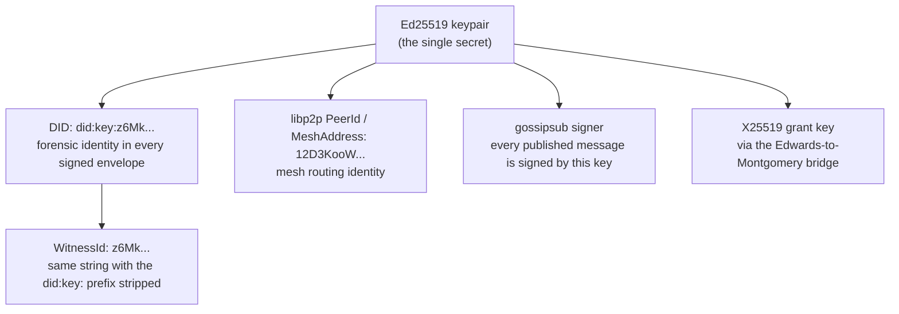
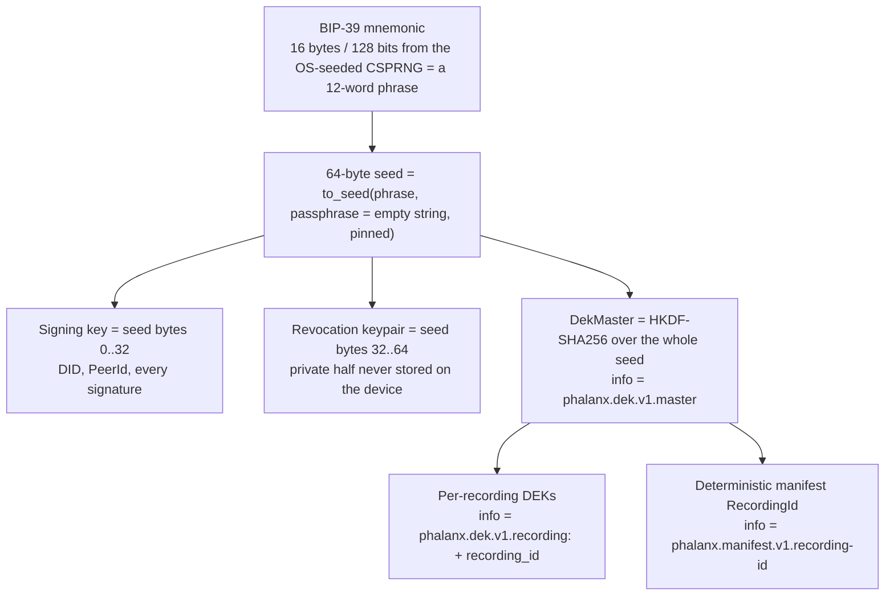
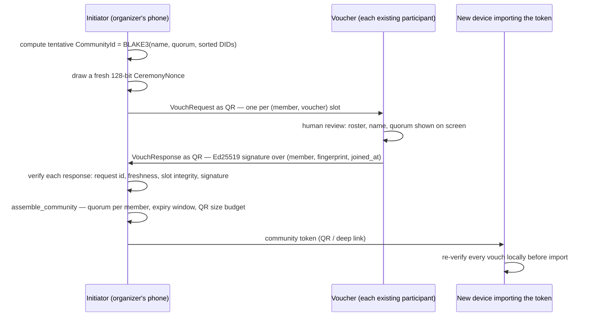

# Phalanx Trust Model — identity, keys, communities, and trust boundaries

This document explains who is who in a Phalanx deployment: how a device gets an
identity, what that identity can and cannot do, how groups of devices form
trusted communities, and where the trust boundaries actually sit. No prior
exposure to the codebase is assumed; terms like
[WitnessEnvelope](architecture.md#glossary) and
[Stronghold](architecture.md#glossary) are defined in the glossary of
[architecture.md](architecture.md), and the attack-by-attack catalogue is
[threat-model.md](threat-model.md). Every factual claim below is anchored to a
source file, cited inline like `crates/phalanx-node/src/identity.rs`, with line
numbers where a specific constant or signature is load-bearing.

---

## 1. One key, many costumes

A Phalanx node has exactly one cryptographic root: an Ed25519 keypair. Every
identity the node presents — to the network, to the evidence record, to a grant
recipient — is a different rendering of that same key.

In prose, the five costumes:

- **DID and WitnessId.** The DID is derived directly from the public key:
  `did:key:z` + base58(`0xed 0x01` multicodec prefix ‖ the 32 public-key
  bytes) — `Did::derive_did_key`,
  `crates/phalanx-proto/src/identity/did.rs:122`. It is self-describing:
  anyone holding the string can extract the key offline
  (`resolve_did_public_key`, `crates/phalanx-forensics/src/identity.rs:43`,
  which strictly rejects wrong multicodecs and key lengths). The WitnessId is
  the same string with `did:key:` stripped (`did.rs:132`) — the form stamped
  on every signed [WitnessEnvelope](architecture.md#glossary), with a pinned
  contract that it must remain valid against the same keypair in 2030 even if
  libp2p is replaced (`did.rs:259`).
- **libp2p PeerId / MeshAddress.** The transport builds its libp2p keypair from
  the identical Ed25519 bytes (`crates/phalanx-transport/src/identity_ext.rs:15`,
  `crates/phalanx-transport/src/factory.rs:29`) and renders the PeerId in
  base58 as a `MeshAddress` (`crates/phalanx-transport/src/lib.rs:57`). PeerId
  and WitnessId are two *encodings* of the same public key — not two keys.
- **Gossipsub signer.** The mesh runs `MessageAuthenticity::Signed` with
  `ValidationMode::Strict` (`crates/phalanx-transport/src/builder.rs:153-161`):
  every published gossip message is signed by the key that defines the DID.
- **X25519 grant key.** For encryption-to-a-DID, the Ed25519 key is bridged to
  X25519 — public half via Edwards-point decompression to Montgomery form,
  private half via SHA-512 of the secret, bytes 0..32
  (`crates/phalanx-forensics/src/cryptography/bridge.rs:9`, `:24`). A test pins
  that the two halves agree, since silent drift would make ECDH between nodes
  fail undetectably (`bridge.rs:71`).

**The deliberate consequence: presence and authorship are linkable.** Because
the routing identity (PeerId) and the forensic identity (DID/WitnessId) are the
same key, an observer who can see a device on the mesh can link it to the
evidence it signs, and vice versa. This is a decision, not an oversight: the
entire value of a WitnessEnvelope is that a specific, accountable identity
signed it, and the trust ladder, reputation system, and vouch ceremonies all
key off that identity. The system is **pseudonymous** — a DID is not a legal
name and nothing on the wire carries one — but it does not attempt
unlinkability between presence and authorship. Accountability was chosen over
unlinkability. (One internal caveat: trust bookkeeping sometimes wraps a
PeerId string in a DID-shaped shim for map lookups; `Did::from_mesh_address`
documents that such strings are *not* valid DIDs —
`crates/phalanx-proto/src/identity/did.rs:147`.)

---

## 2. The key hierarchy

Everything a persistent identity can do is derived from one human-recoverable
secret: a BIP-39 mnemonic.

The derivation lives in `PhalanxIdentity::generate()` and `restore()`
(`crates/phalanx-node/src/identity.rs:53-139`):

- 16 bytes (128 bits) from the OS-seeded CSPRNG (`rand::rng()`) become a
  BIP-39 mnemonic — per the BIP-39 spec, a 12-word phrase
  (`identity.rs:54-58`). The BIP-39 passphrase ("25th
  word") is pinned to the empty string as a versioned constant,
  `BIP39_PASSPHRASE_V1 = ""` (`identity.rs:22`), so an accidental change
  cannot silently fork every derivation.
- Signing key = `SigningKey::from_bytes(seed[0..32])`; revocation keypair from
  `seed[32..64]`, of which only the *public* half is kept
  (`identity.rs:63-76`). The only way to obtain the revocation private key is
  `revocation_signing_key(phrase)`, which re-derives it from the mnemonic on
  demand (`identity.rs:47-49`, `:289-299`).
- The `DekMaster` is HKDF-SHA256 over the entire 64-byte seed with info
  `"phalanx.dek.v1.master"`, domain-separated from the slice derivations
  (`crates/phalanx-forensics/src/cryptography/dek.rs:50`). Every per-recording
  data-encryption key (DEK) is expanded from it with info
  `"phalanx.dek.v1.recording:" ‖ recording_id` (`dek.rs:68`). Identical inputs
  yield the identical key forever — the *recovery promise*: the phrase applied
  to a fresh device decrypts every recording made under that identity
  (`dek.rs:1-16`). Info strings are version-pinned and diverge at byte 8 from
  the manifest derivation, so cross-derivation collisions are impossible
  (`dek.rs:39`).
- The seed itself is zeroized immediately after derivation (`identity.rs:89`).

Identities created without a phrase (`PhalanxIdentity::new_ephemeral()`,
`crates/phalanx-proto/src/identity/did.rs:377`) get a random DekMaster and an
all-zeros revocation key: their recordings are neither phrase-recoverable nor
revocable, by construction. There is no `PhalanxIdentity::new()` — the
constructor suffix documents the invariant.

### At-rest protection classes

| Artifact | Protection | Rationale |
|---|---|---|
| `identity.bin` (signing key + DekMaster + revocation public key) | Argon2id (19 MiB, t=2, p=1, pinned at compile time) derives a key from a passphrase; XChaCha20-Poly1305 seals the file as `[16-byte salt][24-byte nonce][ciphertext]` (`crates/phalanx-forensics/src/cryptography/identity.rs:31`, `:41-75`) | The only authorized serialization path for private key bytes; `PhalanxIdentity` itself has no Serialize/Deserialize and its Debug prints `[REDACTED]` (`crates/phalanx-proto/src/identity/did.rs:351`, `:508`). The code is candid that at these parameters a GPU attacker tests ~thousands of passphrases/sec: the wall assumes a high-entropy passphrase, and with a short PIN the real protection is device-level full-disk encryption (`identity.rs:23-27` comment). |
| Vault files: `content_keyring.bin`, recording policy metadata, PRNU posterior, sealed recording snapshots | XChaCha20-Poly1305 under a vault key = `blake3::derive_key("phalanx.vault.v1.disk-encryption", keypair_bytes ‖ salt)`; the 32-byte salt sits unencrypted in `.vault_salt` (`crates/phalanx-node/src/persistence/vault/crypto.rs:20-30`) | The salt means identity-key compromise alone does not directly yield the vault key (the M7 fix). Writes are atomic (tmp + rename), reads authenticate via the AEAD tag (`vault/crypto.rs:66-108`). |
| Recording logs (`*.recording`) | Frame payloads are XChaCha20-Poly1305 ciphertext under the per-recording DEK | Media never touches disk in plaintext; the DEK for own recordings is not even stored (derived on demand from DekMaster — `crates/phalanx-node/src/persistence/vault/mod.rs:249`). |
| `trust_registry.bin` (peer DIDs, pet names, trust levels, reputation, blacklist) | **Plaintext** postcard (`crates/phalanx-node/src/trust.rs:509-518`) | A deliberate, documented decision: threat-model.md §17 classifies persisted reputation as seizure-tolerable — knowing a phone once blacklisted `did:key:zFoo` reveals neither an event nor a group membership. What *would* be damaging (community rosters) is never written to mobile disk at all. |
| Community rosters, Silent Canary watch set, replay Bloom filters | **RAM only** on mobile (`crates/phalanx-node/src/trust.rs:186-188`; `crates/phalanx-node/src/vitals/canary.rs:9-10`) | Mobile is treated as seizable (threat-model.md §17). A seized phone's disk must not contain a who-knows-whom map. |
| Revocation private key | **Nowhere.** Re-derived from the mnemonic on demand (`crates/phalanx-node/src/identity.rs:289`) | The authority to destroy evidence lives off-device, in the user's head or paper backup. |

One production-checklist item, stated plainly: the Flutter app currently seals
`identity.bin` under a hardcoded development passphrase
(`flutter_app/lib/main.dart:58`), with a TODO to replace it with a
hardware-keystore-backed key. Until that lands, mobile identity-at-rest
strength is the device's own full-disk encryption — a known placeholder, not a
hidden weakness.

---

## 3. The trust ladder

Per-peer trust is a four-rung enum, `TrustLevel`, in ascending order:
`Blocked < Ignored < Verified < Ally`, `Ignored` being the default
(`crates/phalanx-proto/src/identity/trust.rs:25-32`). Levels are assigned
*locally* — there is no global trust authority. Community membership can raise
a peer's *effective* floor (next section), but `Blocked` is absolute:
`effective_trust` returns `Blocked` regardless of community baseline
(`crates/phalanx-node/src/trust.rs:86-106`).

| Level | How a peer gets here | Ingress under stress | Egress (evidence service) | Other rights |
|---|---|---|---|---|
| **Blocked** | Automatic: reputation score ≤ 0, or any single offense with penalty > 100 (`crates/phalanx-node/src/trust.rs:483-490`). Never assigned by elevation. | Refused outright under Serious/Critical stress; blacklisted DIDs are rejected at the trust gate before any processing (`crates/phalanx-forensics/src/verification/gate.rs:80-89`) | Refused (`crates/phalanx-forensics/src/policy.rs:210-214`) | Signature verification is skipped only in the sense that the peer's data is dropped entirely (`policy.rs:78-82`). Recovery loop skips blacklisted peers (`policy.rs:33-35`). |
| **Ignored** (default) | Every unknown or newly-seen DID | Admitted under Nominal/Fair stress; refused under Serious/Critical (`policy.rs:156-162`); first eviction candidate when slots fill | Refused — outbound evidence requires at least Verified (`policy.rs:210-214`) | Can gossip into the node (subject to all gates); earns nothing by default |
| **Verified** | Manual assignment by the operator, or community elevation (the mobile ceremony path pins community baseline trust to Verified — `crates/phalanx-ffi/src/community.rs:248`) | Admitted even under Serious/Critical stress (capacity shrinks to a single slot) | Served, with mandatory encryption applied at authorization (`policy.rs:216-227`) | Preempts Ignored occupants for ingress slots |
| **Ally** | Manual assignment only | Same as Verified; preempts Verified occupants when contested | Served | Highest preemption priority |

The mechanics behind that table: `IngressGovernor` capacity is
`base_max_slots` under Nominal stress, `max(1, base/3)` under Fair, and
exactly 1 under Serious/Critical
(`crates/phalanx-forensics/src/policy.rs:132-138`); when full, a peer with
*strictly* lower trust is evicted (`policy.rs:170-183`).
`EgressGovernor::authorize` is the single path from a Verified unit to a
Sealed (egress-authorized) one, and payload encryption is the mandatory side
effect of authorization (`policy.rs:192-227`). And Blocked is
**manual-pardon-only**: no code path in the workspace ever sets
`is_blacklisted` back to `false`; the only practical pardon is removing the
peer record entirely (`TrustRegistry::remove_peer`,
`crates/phalanx-node/src/trust.rs:406-416`), after which a re-registered peer
starts fresh.

---

## 4. Trusted communities

A trusted community (the "Shield Wall" in the code's prose — a documentation
umbrella, not a type name; `crates/phalanx-proto/src/identity/community.rs:3`)
is a web of trust with **no central keypair**: a member is admitted when a
quorum *k* of distinct people sign Ed25519 vouches for them. The vouch
ceremony is an in-person QR exchange:

The same facts in prose:

- The initiator computes a tentative `CommunityId` and issues one
  `VouchRequest` per (member, voucher) slot, each with a deterministic
  `request_id` = BLAKE3 over a domain string, the tentative fingerprint, a
  per-ceremony 128-bit nonce, and the length-prefixed voucher and member DIDs
  (`crates/phalanx-proto/src/identity/community.rs:480-557`). The nonce only
  protects the initiator's bookkeeping across aborted-and-restarted
  ceremonies; the security binding is the voucher's signature
  (`community.rs:429-445`).
- A vouch is an Ed25519 signature over (member DID ‖ 32-byte community
  fingerprint ‖ joined_at) (`crates/phalanx-forensics/src/identity.rs:77-103`).
  Response verification checks, in order: request-id match, freshness against
  the *signed* timestamp, slot integrity, then the signature (freshness window
  3600 s, forward skew tolerance 300 s — `identity.rs:18-23`).
- `assemble_community` — the single Laboratory verb the mobile FFI and the
  Stronghold ceremony panel both call — enforces freshness, the expiration
  window, member/vouch caps (256 each), per-vouch signature verification,
  per-member quorum via the sealed constructor `MemberEntry::new_validated`
  (self-vouches excluded, duplicate vouchers collapsed —
  `community.rs:154-174`), and a 2,800-byte serialized-token budget so the
  token fits in a QR code (`crates/phalanx-forensics/src/identity.rs:27-41`).
  A zero quorum is unrepresentable (`Quorum::new(0)` returns `None`,
  `community.rs:79-85`).
- Import is re-verified on **every** device — phones and Strongholds both run
  `verify_community_vouches` (expiry, quorum re-check, every signature) before
  inserting (`crates/phalanx-forensics/src/identity.rs:115-153`). The token
  courier is never trusted.

**The CommunityId is both the name and the key.** It is a deterministic,
domain-separated BLAKE3 hash of the founding parameters — name, quorum, and
the lexicographically sorted member DIDs (`community.rs:51-69`). That same
32-byte value is the input keying material for the community's traffic keys:
heartbeats use `blake3::derive_key("phalanx.heartbeat.v1.community", cid)`
(`crates/phalanx-node/src/actors/vitals_actor.rs:186-189`) and ride the node's
control topic (default `/phalanx/control`,
`crates/phalanx-node/src/config.rs:243`; publish at
`vitals_actor.rs:200-203`); [Silent Canary](architecture.md#glossary) alerts
use `"phalanx.canary.v1.community-alert"`
(`crates/phalanx-node/src/actors/canary_supervisor.rs:291-294`) and ride the
generic `/phalanx/mesh/1.0.0` topic (`canary_supervisor.rs:310-313`,
`crates/phalanx-proto/src/network/topic.rs:33-37`). Both are wrapped in
XChaCha20-Poly1305 and travel as opaque ciphertext on shared static topics, so
on each topic community traffic is indistinguishable from any other encrypted
control message (the full topic table is [network.md](network.md) §3). **Roster secrecy
is therefore the confidentiality boundary**: whoever knows the roster can
recompute the id and hence the keys — which is why a code comment insists the
id stay high-entropy ("do not replace with human-readable strings",
`community.rs:34-35`).

The consequences, each a design decision with its rationale:

- **No eviction, no key rotation.** The community API is import / lookup /
  dissolve; key derivation takes only the static CommunityId. This is forced
  by the design, not omitted from it: changing the roster changes the hash and
  therefore creates a *different community*. Rotation-by-mutation would
  require a central key authority, which the web-of-trust model deliberately
  refuses to have.
- **A past member — or anyone who photographed a token QR — can decrypt the
  community's heartbeat and canary traffic for the community's whole life.**
  Dissolution is local-only (`Community::dissolve()` zeroizes the local copy
  and affects no other device — `community.rs:273-287`); it cannot reach into
  someone else's memory.
- **The 30-day maximum lifetime is the rotation mechanism.** Expirations are
  bounded at assembly — minimum 5 minutes, maximum 30 days
  (`crates/phalanx-forensics/src/identity.rs:27-31`) — and expired communities
  are swept on boot and on maintenance ticks
  (`crates/phalanx-node/src/trust.rs:239-243`, `:267-289`). Mortality forces a
  fresh ceremony — new roster hash, new CommunityId, new keys — capping the
  exposure window of any leaked roster without inventing a rotation protocol.
- **RAM-only on phones, persisted on the Stronghold.** On mobile,
  `TrustRegistry.communities` is `#[serde(skip)]` and explicitly "NOT gossiped
  — membership is private" (`crates/phalanx-node/src/trust.rs:184-188`); a
  phone restart loses the roster until the next QR import. That is the
  threat-model §17 asymmetry working as intended: a seized phone's disk
  carries no roster. The Stronghold *does* persist rosters
  (`{vault}/communities/*.bin`, auto-hydrated and re-verified on boot —
  `crates/phalanx-stronghold/src/gui/bridge.rs:151-222`) because dropping them
  on restart would orphan every shard filed under the community's directory;
  its protection is operational (premises, disk encryption, jurisdiction).
- **What membership conveys.** `CommunityGrants` defaults to
  `{ export_to_stronghold: true, mesh_trust_elevation: true }`
  (`community.rs:220-227`); elevation raises a member's effective trust to the
  community baseline (Verified, on the mobile path) but never rehabilitates a
  Blocked peer. A watch channel republishes the key set on import, dissolve,
  and expiry, so heartbeat and canary code stop using a dissolved community's
  keys without a restart (`crates/phalanx-node/src/trust.rs:189-205`).

One honest subtlety: quorum counts *k unique external DIDs with valid
signatures* — the verifier does not require vouchers to themselves appear on
the roster (`community.rs:154-174`,
`crates/phalanx-forensics/src/identity.rs:115-153`). The ceremony flow only
issues requests to roster slots, so this is a non-issue in practice, but it is
why human review of the roster at vouch time (the ceremony's Review screen) is
part of the protocol, not decoration.

---

## 5. Grants: the only path to plaintext

Evidence payloads are encrypted under per-recording DEKs. Nothing on the mesh —
not relay storage, not custody, not community membership — yields plaintext.
The only way a second party ever decrypts a recording is a **grant**: a
[SealedLocator](architecture.md#glossary) carrying the recording's DEK
encrypted to one specific recipient.

Mechanically (`SealedLocator::seal`,
`crates/phalanx-forensics/src/cryptography/grant.rs:30-81`): the recipient's
X25519 public key is resolved *offline* from their self-describing `did:key`
via the Edwards→Montgomery bridge; an X25519 ECDH shared secret is run through
`blake3::derive_key("phalanx.grant.v1.ecdh-seal", ...)`; and the 32-byte
recording key is encrypted with XChaCha20-Poly1305 under a fresh 24-byte
nonce. **Permissions ride in the AAD**: the additional authenticated data is
the sender's DID bytes ‖ the serialized `GrantPermissions` (`grant.rs:56-61`).
`GrantPermissions` has exactly two flags, `playback` and `export`, defaulting
to `{ playback: true, export: false }`
(`crates/phalanx-proto/src/identity/crypto.rs:77-91`); because they are
authenticated rather than merely attached, an interceptor cannot flip
`export: false` to `true` without breaking the Poly1305 tag — `unlock()`
rebuilds the identical AAD and fails on any tamper (`grant.rs:102-120`).
`unlock()` also enforces recipient sovereignty up front
(`self.recipient != me.did` → failure, `grant.rs:85-87`), and even without
that check a third party cannot compute the ECDH secret. The grant renders as
a `phx-grant://` URI for transport (`crypto.rs:116-127`).

**Escrow-for-export.** When a phone pushes a recording to a DID-configured
Stronghold, `mint_export_grant` re-derives the recording's DEK from the
publisher's own DekMaster and seals it to the Stronghold's DID with
`{ playback: false, export: true }`
(`crates/phalanx-node/src/actors/archive_grant.rs:30-57`). The standing
authority a Stronghold holds is exactly this: the ability to decrypt **that
recording**, for export, because **that publisher chose to grant it**. It
cannot decrypt anything else it stores — its aggregation actor is explicit
that it "never decrypts — grants are provided at corroboration time"
(`crates/phalanx-stronghold/src/actors/aggregation.rs:5`) — and if grant
sealing fails, the push falls back to custody-only ciphertext.

**What "selective sharing" means operationally.** Every recording has its own
DEK, so granting a lawyer playback of one recording reveals nothing about any
other; permissions distinguish viewing from C2PA export. One honest limit: a
grant, once unlocked, has delivered a 32-byte key to the recipient's device.
Revocation (section 8) destroys the cooperating network's copies; it cannot
claw back a key or plaintext already exfiltrated. No system can, and Phalanx
does not pretend to.

---

## 6. Reputation is local, forever

Every node keeps its own ledger of peer behavior — the
[TrustRegistry](architecture.md#glossary)
(`crates/phalanx-node/src/trust.rs:175`), a `Did → PeerRecord` map persisted to
`trust_registry.bin`, with a synchronized in-process projection
(RwLock-guarded maps, poison-tolerant — `trust.rs:27-33`) that transport code
reads on the hot path.

**Offenses and points.** Every peer starts at score 100
(`crates/phalanx-proto/src/identity/trust.rs:48-62`). Offenses subtract points
(`assess_penalty`, `crates/phalanx-forensics/src/trust/evaluation.rs:5-13`):

| Offense | Penalty |
|---|---|
| InvalidSignature, IdentityTheft | **101** — instant blacklist, even from full health |
| EclipseAttempt, DualPresence (detection deferred per its doc comment) | 50 |
| QuotaExceeded | 25 |
| SpectralAnomaly, NonReciprocal | 15 |
| ReplayAttack, MalformedPacket, ProtocolViolation, TemporalSkew | 10 |

A peer is blacklisted when its score reaches ≤ 0 *or* any single penalty
exceeds 100 (`crates/phalanx-node/src/trust.rs:483-490`) — so one invalid
signature is a one-strike ban. Recovery ("decay" of the penalty) is quadratic
in the current score with a 5% floor, gated by a 60-second post-offense
cooldown, capped at 100, and **skips blacklisted peers entirely**
(`crates/phalanx-forensics/src/policy.rs:23-73`); pardon is manual record
deletion only (section 3). Sybil hygiene: unknown DIDs are lazily registered
on first offense, capped at 10,000 records
(`crates/phalanx-node/src/trust.rs:171`, `:437`), and unknown peers start at
0.1 evaluation weight, not 1.0 (`trust.rs:684-687`). Signature verification is
unconditional for every non-blacklisted peer — there is no trusted-peer fast
path (`policy.rs:75-83`). Lock poisoning fails secure: a poisoned projection
reads as Blocked / blacklisted / score 0 (`trust.rs:49-84`).

**The design law: no reputation or blacklist data ever crosses the wire.**
The mesh runs a small fixed set of static gossip topics — media, control,
revocation, and the generic mesh topic
(`crates/phalanx-proto/src/network/topic.rs:25-37`,
`crates/phalanx-node/src/config.rs:241-243`; the full per-topic table at
defaults is [network.md](network.md) §3) — and none carries reputation,
offenses, or blacklists. The rationale is
twofold. First, gossiped blacklists are a poisoning vector: an adversary who
can inject "peer X is malicious" into a shared list gets censorship for free;
in Phalanx, to make the network ignore someone you must convince each node's
*own observations*. Second, a reputation gossip stream is a deanonymization
side channel — it broadcasts who interacted with whom and what they concluded.
Each node's social graph stays its own. (Nuance for code readers: DHT provider
records contain a `reputation_score` field, but each node fills it from its
*own* evaluator for local provider-ranking; no registry state is transmitted.)
The behavioral evidence feeding this ledger — heartbeat-consistency residuals
that produce `SpectralAnomaly` offenses and drive Byzantine decoupling — is
described in [spectral-observer.md](spectral-observer.md).

---

## 7. Time

Phalanx separates "what time is it" from "who may ask." `PhalanxTimestamp::now()`
is `pub(crate)` inside phalanx-proto (`crates/phalanx-proto/src/time.rs:37`):
code outside the Dictionary cannot read the raw wall clock and must go through
a [TrustedClock](architecture.md#glossary) implementor — the trait at
`crates/phalanx-proto/src/time.rs:49`, implemented by the NTP-corrected struct
of the same name in `crates/phalanx-node/src/clock.rs:71`. (The shared name is
a known stumbling block: the trait returns a timestamp, the struct's inherent
`now()` returns a `Result`.)

**The temporal gate.** On receive, every envelope passes an *unconditional*
freshness check as step 2 of the integrity gate — it runs even for
chain-anchored units, because an attacker who knows a valid previous-hash must
not be able to inject evidence dated years into the future
(`crates/phalanx-forensics/src/verification/gate.rs:151-168`). The check is a
two-sided window — the claimed timestamp must lie within ±tolerance of
TrustedClock-now (`verify_freshness`,
`crates/phalanx-forensics/src/verification/judge.rs:163-183`). A recorder's
signature proves *who* made a claim; the temporal gate bounds *when* it can be
injected.

**The honest caveat: the SNTP upstream is unauthenticated.** `synchronize()`
resolves `pool.ntp.org:123` over plain DNS, takes the first address, and runs
a plain SNTP exchange; the offset is computed at whole-second granularity
(`crates/phalanx-node/src/clock.rs:145-191`). There is no NTS, no symmetric
NTP keys, no server authentication. An on-path attacker can therefore skew the
node's clock offset. What that does and does not endanger: **not endangered**
are signatures, hashes, chain links, grants, vouches, and revocation tokens —
none depend on the local clock for cryptographic validity, and stored evidence
is untouched. **Endangered** is the freshness window: a skewed clock can make
a node reject honest envelopes as stale/future (a self-inflicted denial of
service) or accept injected envelopes matching the attacker's chosen skew.
Mitigations are containment, not authentication: `now()` clamps at zero
against catastrophically negative offsets (`clock.rs:117-120`), and on any
clock error the trait impl falls back to the last known-good timestamp rather
than epoch zero — epoch zero would fail *every* temporal check at once, which
is exactly what an attacker inducing clock errors would want (the T1 fix,
`clock.rs:195-213`). Authenticated time (NTS) is a known hardening direction,
not a present property.

---

## 8. Revocation: cryptographic forgetting

A user can permanently destroy all evidence for a recording — including copies
held by cooperating relay nodes. The mechanism is key destruction, ordered so
that a crash cannot leave readable data behind.

- **Authority lives off-device.** The [RevocationToken](architecture.md#glossary)
  is signed by the revocation keypair derived from BIP-39 seed bytes 32..64 —
  the private half is never on disk and is re-derived from the typed phrase at
  the moment of revocation (`crates/phalanx-node/src/identity.rs:289-299`).
  Every WitnessEnvelope embeds the revocation *public* key, so any node can
  verify a token with zero external lookups: it carries recording id,
  timestamp, a random 32-byte nonce, the key, and an Ed25519 signature over
  (recording_id ‖ issued_at ‖ nonce), checked with `verify_strict`
  (`crates/phalanx-forensics/src/trust/revocation.rs:63-79`).
- **Permanent by design.** Once a valid token is broadcast, no mechanism
  exists to cancel it — even the mnemonic holder cannot un-revoke. The threat
  model prioritizes the right to destroy one's own evidence over recovery from
  accidental revocation (`crates/phalanx-proto/src/evidence/revocation.rs:43-47`).
- **Crash-safe execution order.** On a receiving node, `handle_revoke`
  (`crates/phalanx-node/src/actors/storage.rs:760-836`) verifies the token's
  self-contained signature, runs a consistency check against the recording's
  embedded key, and rejects revocations for entirely unknown recordings
  (accepting unknown ids would allow cross-identity destruction; late joiners
  learn of revocations via tombstone). `Guardian::revoke_recording`
  (`crates/phalanx-node/src/persistence/vault/mod.rs:535-586`) then **destroys
  the keyring DEK and persists the keyring to disk first** — after which the
  ciphertext is permanently unreadable — then drops in-memory state,
  zero-overwrites and deletes the recording log as defense in depth, and marks
  the id revoked so future shards are refused; the storage actor then journals
  the token for crash recovery (`storage.rs:822-829`). On boot, a ghost-key
  sweep destroys any content keys that survived a partial crash
  (`storage.rs:302-325`).
- **Own recordings, honestly.** For the owner's deterministic recordings,
  `destroy_content_key` returns `false` — there is no keyring entry, because
  the DEK is derivable from the phrase. Shredding there means deleting the
  encrypted blobs; destroying the *phrase* is the user's responsibility, and
  the code says so (`vault/mod.rs:277-291`).
- **Delivery.** Tokens are published on the `/phalanx/revocation/1.0.0` gossip
  topic and replayed point-to-point to each newly admitted peer
  (`ReplayRevocations`, `crates/phalanx-node/src/actors/eclipse_router.rs:78-80`).
  Since the June 2026 topic-alignment fix, the revocation topic is in both the
  node's and the Stronghold's default subscribe lists
  (`crates/phalanx-node/src/network/orchestrator.rs`,
  `crates/phalanx-stronghold/src/swarm.rs`), so connected default-config peers
  receive tokens via gossip and offline peers catch up via the admission-time
  replay. One residual caveat: publish sites hardcode the canonical topic, so
  the `revocation_topic` config field should be left at its default —
  [network.md §3](network.md#3-topics-who-publishes-who-listens).

---

## 9. Deliberate non-checks

Several places in the code conspicuously do *not* verify something. Each is a
recorded decision with an audit trail. Documenting them here prevents the next
auditor from re-flagging settled questions — or "fixing" them into regressions.

| What is not checked | Where | Why it is safe (recorded rationale) |
|---|---|---|
| Retrieval requests carry no grant/ACL check — any identity can self-sign a well-formed request | `verify_retrieval_auth`, `crates/phalanx-node/src/identity.rs:236-259`; caller at `crates/phalanx-node/src/actors/retrieval.rs:198-208` | The signature check proves who is asking (and a failure records an `InvalidSignature` offense). Access control is not the request's job: the egress path refuses Blocked/Ignored requesters and **mandatorily encrypts** what it serves (`policy.rs:192-227`), so the requester receives ciphertext; plaintext requires a grant sealed to their DID. Privacy by encryption + grants, never by hiding reachability. |
| Unknown-DID trust lookups fail open: an unseen DID reads as not-blacklisted / `Ignored` | `crates/phalanx-node/src/trust.rs:48-84`; pinned by test comment at `trust.rs:809-827` | The blacklist is authoritative only for peers actually observed. Failing closed would let an attacker *name* an arbitrary DID and have it inherit a ban — a censorship lever. Unknown peers still get minimum evaluation weight (0.1) and the default `Ignored` entitlements (no egress service). |
| The replay Bloom filter is consulted and populated *before* signature verification | `crates/phalanx-node/src/actors/storage.rs:619-662`; [threat-model.md](threat-model.md) §3 | An accepted performance tradeoff with a documented blast radius: an attacker replaying an honest envelope with a mangled signature can poison the local filter for at most one rotation cycle, on this node only — peers re-verify independently. Verify-first would cost one Ed25519 verify per duplicate arrival on the gossip hot path (the common case for honest gossip). The comment forbids reordering without updating the threat model. |
| `handle_revoke` reads an arbitrary, unverified local envelope for its consistency gate | `crates/phalanx-node/src/actors/storage.rs:768-792`; [threat-model.md](threat-model.md) §9 | The cryptographic trust anchor is the token's own signature against the mnemonic-derived key, checked first; the envelope-key equality is consistency, not authorization. An attacker who plants a shard with a chosen revocation key still cannot forge a token without the BIP-39 seed. The comment is explicit: do **not** "harden" this with `verify_envelope` — it adds cost and closes nothing. Audit-closed. |

---

## 10. Trust boundaries

What each adversary class can and cannot do, and which mechanism stops them.
Cross-references are to [threat-model.md](threat-model.md) sections.

| Adversary | Can | Cannot | What stops them |
|---|---|---|---|
| **Seized phone** (offline disk access; §17) | Read the plaintext peer ledger in `trust_registry.bin` (DIDs, pet names, trust levels, blacklist); see that Phalanx is installed and how much ciphertext exists | Decrypt the vault or recording logs without the identity passphrase (the vault key derives from the sealed identity); recover community rosters, the canary watch set, or replay filters (RAM-only); forge or revoke evidence | Argon2id+XChaCha20 wall on `identity.bin` (`crates/phalanx-forensics/src/cryptography/identity.rs`); role-asymmetric persistence (threat-model §17); revocation authority off-device. Honest qualifier: with the current dev-passphrase placeholder, the identity wall is the device's FDE (section 2). |
| **Malicious admitted peer** (community member in good standing) | Occupy ingress slots even under stress; receive sealed (encrypted) evidence via retrieval; decrypt its communities' heartbeats and canary alerts; re-import its token until expiry | Read evidence plaintext without a grant sealed to its own DID; satisfy a quorum alone (self-vouches excluded, duplicate vouchers collapsed); survive misbehavior — one 101-point offense blacklists it, and Blocked overrides community elevation | Grants as the only path to plaintext (`grant.rs:85-87` recipient check, AAD-bound permissions); `MemberEntry::new_validated` quorum rules; absolute-Blocked rule (`trust.rs:86-106`) |
| **Compelled Stronghold operator** (subpoena, insider; §17 residual risk) | Disclose persisted community rosters (member DIDs, quorum, expiry); disclose the community→recording→shard directory structure and envelope metadata (owner DIDs, sequences, signatures); decrypt and export exactly those recordings holding an export grant sealed to the Stronghold's DID | Decrypt any recording without a grant — custody-only holdings are ciphertext; flip a grant's permissions (AAD-authenticated); mint grants to itself | Per-recording grants with publisher-side minting (`archive_grant.rs:30-57`); the aggregation path's "never decrypts" posture; remaining exposure is deployment-level — premises, disk encryption, jurisdiction (threat-model §17) |
| **Past community member** (or anyone who copied a token QR) | Derive the community's heartbeat/canary keys forever from the static CommunityId; locate that community's evidence directory on a Stronghold disk by its id; keep any recording DEK it ever unlocked via grant | Decrypt evidence payloads it never held a grant for (control-traffic keys ≠ recording DEKs); extend the community past its expiry; impersonate other members (vouches and envelopes are per-key signatures) | The 30-day mortality ceiling as the re-key mechanism; key separation between community control traffic and per-recording DEKs; signature-bound identity everywhere |
| **Network observer** (passive wiretap / mesh participant) | Link a device's mesh presence to its evidence authorship (one key, by design — section 1); see topic names and traffic volume; collect ciphertext | Read evidence or community traffic (encrypted; community messages ride shared generic topics — the control topic for heartbeats, the generic mesh topic for canary alerts — as opaque ciphertext, indistinguishable from other encrypted control traffic on those topics); forge envelopes, vouches, or revocations; learn rosters, reputations, or blacklists from the wire (never transmitted) | Encryption + grants as the privacy boundary; few-static-topics anonymity-set design (`topic.rs:33-37`); local-only reputation (section 6). Reminder: pseudonymity, not unlinkability, is the claim. |

The recurring shape of all five rows: identity is one accountable key;
confidentiality is carried by encryption keys (DEKs, grant seals, community
ids) rather than by hiding; and the authority that matters most — revocation —
lives off-device entirely. Where a boundary is operational rather than
cryptographic, this document and the threat model say so rather than rounding
up.
